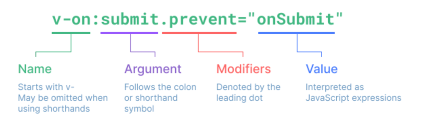
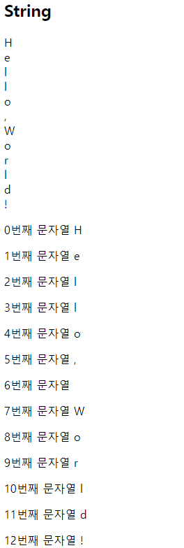
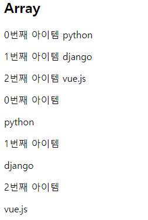
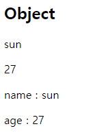

# Basic Syntax

## Template Interpolation

```html
<div id="app">
  <p>메시지: {{ msg }}</p>
  <p>HTML 메시지 : {{ rawHTML }}</p>
  <p>HTML 메시지 : <span v-html="rawHTML"></span></p>
  <p>{{ msg.split('').reverse().join('') }}</p>
</div>
```

```javascript
<script>
  // 1. Text interpolation
  const app = new Vue({
    el: "#app",
    data: {
      msg: "Text interpolation",
      rawHTML: '<span style="color:red"> 빨간 글씨</span>',
    },
  });
</script>
```

✔ 가장 기본적인 바인딩(연결) 방법  
✔ 중괄호 2개로 표기

## Directives

### 기본 구성

✔ **v-접두사**가 있는 특수 속성에는 값을 할당할 수 있다.

- 값에는 JS표현식을 작성할 수 있음

✔ directive의 역할은 표현식의 값이 변결될 때 반응적으로 DOM에 연결하는 것



✔ `:`을 통해 전달인자를 받을 수 있음  
✔ `.`으로 표시되는 특수 접미사 directive을 특별한 방법으로 바인딩

### v-text & v-html

```html
<div id="app2">
  <!-- v-text & {{}} -->
  <p v-text="message"></p>
  <!-- 동일 -->
  <p>{{ message }}</p>
</div>
```

```javascript
const app2 = new Vue({
  el: "#app2",
  data: {
    // text
    message: "Hello!",
    // html
    html: '<a href="https://www.google.com">GOOGLE</a>',
  },
});
```

✔ Template interpolation과 함께 가장 기본적인 바인딩 방법

✔ v-html

- RAW HTML을 표현할 수 있는 방법
- 단, **사용자가 입력하거나 제공하는 컨텐츠에는 절대 사용 금지** (XSS 공격)

### v-show & v-if

```html
<div id="app3">
  <p v-show="isActive">보이니? 안보이니?</p>
  <p v-if="isActive">안보이니? 보이니?</p>
</div>
```

```javascript
const app3 = new Vue({
  el: "#app3",
  data: {
    isActive: false,
  },
});
```

✔ v-show

- 표현식에 작성된 값에 따라 element를 보여줄 것인지 결정(boolean 값이 변경될 때마다 반응)
- 대상 element의 display속성을 기본 속성과 none으로 toggle
- 요소 자체는 항상 DOM에 렌더링 된다.

✔ v-if

- v-show와 사용 방법은 동일
- **값이 false인 경우 DOM에서 사라짐**

### v-show vs v-if

✔ v-show(Expensive initial load, cheap toggle)

- 표현식 결과와 관계없이 렌더링 되므로 초기 렌더링에 필요한 비용은 v-if보다 높을 수 있음
- display 속성 변경으로 표현 여부를 판단하므로 렌더링 후 toggle 비용은 적음

✔ v-if (Cheap initial load, expensive toggle)

- 표현식 결과가 false인 경우 렌더링조차 되지 않으므로 초기 렌더링 비용은 낮을 수 있음
- 단, 표현식 값이 자주 변경되는 경우 잦은 재 렌더링으로 비용이 증가
- else, if-else 등과 함께 조건문으로 이용

### v-for

1. string

```html
<div id="app">
  <h2>String</h2>
  <div v-for="char in myStr">{{ char }}</div>
  <div v-for="(char, index) in myStr" :key="index">
    <p>{{ index }}번째 문자열 {{ char }}</p>
  </div>
</div>
```

```html
<script>
  const app = new Vue({
    el: "#app",
    data: {
      // 1. String
      myStr: "Hello, World!",
    },
  });
</script>
```



2. array

```html
<h2>Array</h2>
<div v-for="(item, index) in myArr" :key="index">
  <p>{{ index }}번째 아이템 {{ item }}</p>
</div>

<div v-for="(item, index) in myArr2" :key="`arry-${index}`">
  <p>{{ index }}번째 아이템</p>
  <p>{{ item.name }}</p>
</div>
```

```html
<script>
  const app = new Vue({
    el: "#app",
    data: {
      // 2-1. Array
      myArr: ["python", "django", "vue.js"],

      // 2-2. Array with Object
      myArr2: [
        { id: 1, name: "python", completed: true },
        { id: 2, name: "django", completed: true },
        { id: 3, name: "vue.js", completed: false },
      ],
    },
  });
</script>
```



3. objects

```html
<h2>Object</h2>
<div v-for="value in myObj">
  <p>{{ value }}</p>
</div>

<div v-for="(value, key) in myObj" :key="key">
  <p>{{ key }} : {{ value }}</p>
</div>
```

```html
<script>
  const app = new Vue({
    el: "#app",
    data: {
      // 3. Object
      myObj: {
        name: "sun",
        age: 27,
      },
    },
  });
</script>
```



✔ `for.. in..` 형식으로 작성  
✔ 반복하는 데이터 타입에 모두 사용 가능  
✔ index를 함께 출력하고자 한다면 `(char, index)` 형태로 사용 가능

### 특수 속성 key

✔ **v-for 사용 시 반드시 key 속성윽 각 요소에 작성**  
✔ 주로 v-for directive 작성 시 사용  
✔ vue 화면 구성 시 이전과 달라진 점을 확인하는 용도로 활용

- 따라서 key 중복 x

✔ 각 요소가 고유한 값을 가지고 있다면 생략 가능

### v-on

✔ `:`을 통해 전달받은 인자를 확인  
✔ 값으로 JS표현식 작성  
✔ `addEventListener`의 첫번째 인자와 동일한 값들로 구성  
✔ 대기하고 있던 이벤트가 발생하면 할당된 표현식 실행

```html
<body>
  <div id="app">
    <button v-on:click="number++">increase Number</button>
    <p>{{ number }}</p>
  </div>
  ...
</body>
```

```html
<script>
  const app = new Vue({
    el: "#app",
    data: {
      number: 0,
      isActive: false,
    },
  });
</script>
```

✔ method를 통한 data 조작도 가능  
✔ method에 인자를 넘기는 방법은 일반 함수를 호출할 때와 동일한 방식  
✔ `:`을 통해 전달된 인자에 따라 특별한 modifiers(수식어)가 있을 수 있음

- ex) `v-on:keyup.enter`

✔ `@` shortcut 제공

- ex) `@keyup.click`

```html
<body>
  <div id="app">
    ...
    <button v-on:click="toggleActive">toggle isActive</button>
    <button @click="checkActive(isActive)">check isActive</button>
    <p>{{ isActive }}</p>
  </div>
</body>
```

```html
<script>
  const app = new Vue({
    el: "#app",
    data: {
      number: 0,
      isActive: false,
    },
    methods: {
      toggleActive: function () {
        this.isActive = !this.isActive;
      },
      checkActive: function (check) {
        console.log(check);
      },
    },
  });
</script>
```

### v-bind

```html
<div id="app2">
  <a v-bind:href="url">Go To GOOGLE</a>

  <p v-bind:class="redTextClass">빨간 글씨</p>
  <p v-bind:class="{ 'red-text': true }">빨간 글씨</p>
  <p v-bind:class="[redTextClass, borderBlack]">빨간 글씨, 검은 테두리</p>
  <!-- : shortcut -->
  <p :class="theme">상황에 따른 활성화</p>
  <button @click="darkModeToggle">dark Mode {{ isActive }}</button>
</div>
```

```html
<script>
  const app2 = new Vue({
    el: "#app2",
    data: {
      url: "https://www.google.com/",
      redTextClass: "red-text",
      borderBlack: "border-black",
      isActive: true,
      theme: "dark-mode",
    },
    methods: {
      darkModeToggle() {
        this.isActive = !this.isActive;
        if (this.isActive) {
          this.theme = "dark-mode";
        } else {
          this.theme = "white-mode";
        }
      },
    },
  });
</script>
```

✔ **HTML 기본 속성에 Vue data를 연결**  
✔ class의 경우 다양한 형태로 연결 가능  
✔ **조건부 바인딩**

- `{'class Name': '조건 표현식'}
- 삼항 연산자 가능

✔ **다중 바인딩**

- `['JS표현식', 'JS표현식',...]`

✔ `:` shortcut 제공

### v-model

```html
<div id="app">
  <h2>1. Input -> Data</h2>
  <h3>{{ myMessage }}</h3>
  <input @input="onInputChange" type="text" />
  <hr />

  <h2>2. Input <-> Data</h2>
  <h3>{{ myMessage2 }}</h3>
  <input v-model="myMessage2" type="text" />
  <hr />
</div>
```

```html
<script>
  const app = new Vue({
    el: "#app",
    data: {
      myMessage: "",
      myMessage2: "",
    },
    methods: {
      onInputChange: function (event) {
        this.myMessage = event.target.value;
      },
    },
  });
</script>
```

✔ Vue instance와 DOM의 **양방향 바인딩**  
✔ Vue data 변경 시 v-model로 연결된 사용자 입력 element에도 적용  
✔ 한글, 일본어, 중국어 완전히 지원 x
