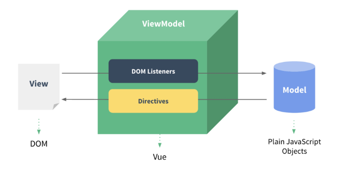
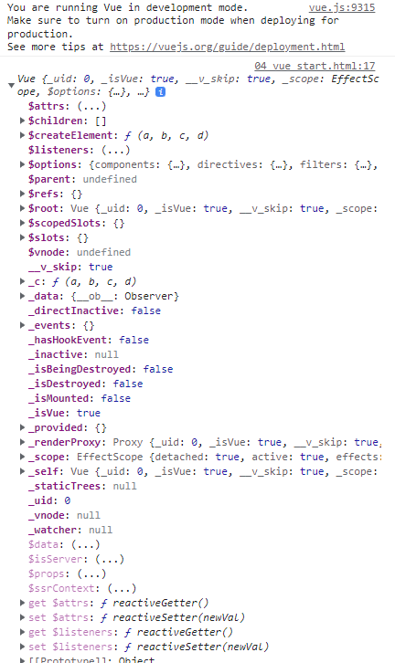

# Vue Instance

## MVVM Pattern

✔ 소프트웨어 아키텍처 패턴의 일종  
✔ 마크업 언어로 구현하는 그래픽 사용자 인터페이스(view)의 개발을 Back-end(model)로부터 분리시켜 view가 어느 특정한 모델 플랫폼에 종속되지 않도록 한다.



✔ **View**: 우리 눈에 보이는 부분(DOM)  
✔ **Model** : 실제 데이터 (JSON)  
✔ **View Model** (Vue)

- View를 위한 Model
- View와 연결(binding)되어 Action을 주고 받음
- Model이 변경되면 View Model도 변경되고 바인딩된 View도 변경
- View Model 데이터가 변경되고 바인딩된 다른 View도 변경

### MVVM Pattern 정리

✔ MVC 패턴에서 Controller를 제외하고 View model을 넣은 패턴  
✔ 독립성 증가, 적은 의존성  
✔ View 에서 데이터를 변경하면 View Model의 데이터가 변경되고 연관된 다른 View도 변경된다.

## Vue Instacne

1. new 연산자를 사용한 생성자 함수 호출

```html
<body>
  <script>
    // 1. Vue instance constructor
    const vm = new Vue();
    console.log(vm);
  </script>
</body>
```



### 생성자 함수

✔ JS에서 객체 생성 - 하나의 객체를 선언하여 생성

```javascript
const member = {
  name: "Sunjun",
  age: 22,
  sId: 2022311491,
};
```

✔ 동일한 구조의 객체를 여러개 만들고 싶다면?

```javascript
function Member(name, age, sId) {
  this.name = name;
  this.age = age;
  this.sId = sId;
}

const member3 = new Member("David", 21, 2022654321);
```

✔ 함수 이름은 반드시 대문자로 시작  
✔ 생성자 함수를 사용할 때는 반드시 `new`연산자를

2. `el(element)`

```html
<body>
  <div id="app">　</div>
  ...
</body>
```

```javascript
const app = new Vue({
  el: "#app",
});
```

✔ Vue instance와 DOM을 mount(연결)하는 옵션

- view와 model을 연결하는 역할
- HTML id 혹은 class와 연결

✔ Vue instance와 연결되지 않은 DOM 외부는 Vue의 영향을 받지 않음

3. `data`

✔ Vue instance의 **데이터 객체** 혹은 **인스턴스 속성**  
✔ 데이터 객체는 반드시 **기본 객체 {}(object)**이어야 한다.  
✔ 객체 내부의 아이템들은 value로 모든 타입의 객체를 가질 수 있다.  
✔ 정의된 속성은 `{{ }}`을 통해 view에 렌더링 가능

```javascript
const app = new Vue({
  el: "#app",
  data: {
    message: "Hello, Vue!",
  },
});
```

✔ 추가된 객체의 각 값들은 `this.message` 형태로 접근 가능

4. `methods`

```javascript
const app = new Vue({
  el: "#app",
  data: {
    message: "Hello, Vue!",
  },
  methods: {
    print: function () {
      console.log(this.message);
    },
  },
});
```

✔ Vue instance의 method들을 정의하는 곳  
✔ 객체 내 print method 정의

- Vue instance의 data내 message 출력
- `app.print()`

```javascript
const app = new Vue({
  el: "#app",
  data: {
    message: "Hello, Vue!",
  },
  methods: {
    ...
    bye: function () {
      this.message = "Bye, Vue!";
    },
  },
});
```

✔ method를 호출하여 data 변경 가능

- 객체 내 bye method 정의
- print method 실행 시 Vue instance의 data내 message 변경

✔ 콘솔창에서 app.bye() 실행

- DOM에 바로 변경된 결과 반영
- Vue의 강력한 반응성(reactivity)
