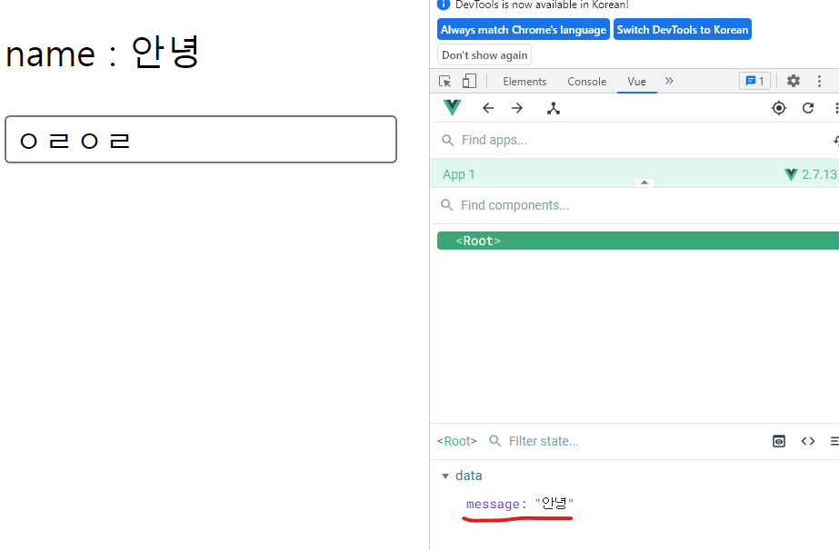

# Vue Intro

## Front-end Framework

✔ Front-end(FE) 개발이란?

- 사용자에게 보여주는 화면 만들기

✔ **Web App(SPA)**을 만들 때 사용하는 도구

- SPA: Single Page Application

### Web App이란?

✔ 웹 브라우저에서 실행되는 어플리케이션 소프트웨어  
✔ 웹 페이지가 그대로 보이는 거싱 아닌 **디바이스에 설치된 App**처럼 보이는 것

### SPA (Single Page Application)

✔ 서버에서 최초 1장의 HTML만 전달 받아 모든 요청에 대응하는 방식  
✔ **CSR(Client Side Rendering) 방식으로 요청 처리**

### [참고] SSR (Server Side Rendering)

✔ Server가 사용자의 요청에 적합한 HTML을 렌더링하여 제공하는 방식  
✔ 계속해서 새로고침을 해야한다는 단점 존재

### CSR (Client Side Rendering)

✔ 각 요청에 대한 대응을 JavaScript을 사용하여 필요한 부분만 다시 렌더링

1. 필요한 페이지를 서버에 **AJAX**로 요청
2. 서버는 화면을 그리기 위해 필요한 데이터를 JSON 방식으로 전달
3. JSON 데이터를 JavaScript로 처리, DOM트리에 반영(렌더링)

### 왜 CSR을 사용할까

1. 모든 HTML 페이지를 서버로부터 받아서 표시 하지 않아도 된다.

- 트래픽 감소 -> 응답속도 향상

2. 매번 새 문서를 받아 새로고침하는 거싱 아니라 필요한 부분만 고쳐나가므로 **각 요청이 끊김없이 진행**

- 사용자 경험(UX) 향상

3. BE와 FE의 작업 영엽 명확히 분리

- 협업 용이

### 그렇다면 CSR은 만능일까?

✔ 첫 구동 시 필요한 데이터가 많으면 많을수록 최초 작동 시작까지 오랜 시간이 소요  
✔ **검색 엔진 최적화(SEO: Search Enginge Optimazation)**이 어려움

- 서버가 제공하는 것은 빈 HTML

✔ HTML에 작성된 내용을 기반으로 한 검색 엔진에 빈 HTML을 공유하는 SPA 서비스가 노출되기 어렵다

### CSR vs SSR

✔ 서비스에 적합한 렌더링 방식을 적절하게 활용해야 한다.  
✔ SPA 서비스에서도 SSR을 지원하는 Framework도 발전!

- Vue: Nuxt.js
- React: Next.js
- Angular Universal

### FE 프레임워크

✔ React, Angular, Vue

### 프레임워크를 꼭 써야 할까?

✔ 생산성과 협업을 위해 사용!

## Why Vue

### 쉬운 난이도

```html
<template>
  <!-- HTML -->
  <div>
    <p>Hello :)</p>
  </div>
</template>

<script>
  // JavaScript
</script>

<style>
  /* CSS */
  p {
    color: black;
  }
</style>
```

✔ 직관적인 구조  
✔ 빠르고 쉽게 학습 & 활용 가능

### Vue CDN 가져오기

[Vue2 공식문서](https://v2.vuejs.org/v2/guide/installation.html)

```html
<script src="https://cdn.jsdelivr.net/npm/vue@2.7.13/dist/vue.js"></script>
```

### Vue로 코드 작성하기

✔ 입력 받은 값을 name 뒤에 출력하기

1. Vue 코드 작성

```html
<body>
  <div id="app">
    <!-- 선언적 렌더링 -->
    <p id="name">name : {{ message }}</p>
    <input id="inputName" type="text" />
  </div>
  <script src="https://cdn.jsdelivr.net/npm/vue@2.7.13/dist/vue.js"></script>
  <script>
    // Vue instance 생성
    const app = new Vue({
      // el, data 설정 - data에 관리할 속성 정의
      el: "#app",
      data: {
        message: "",
      },
    });
  </script>
</body>
```

2. Vue devtools에서 data를 변경할 수 있다.

   

3. input tag에 `v-model` 작성

```html
<body>
  <div id="app">
    <p id="name">name : {{ message }}</p>
    <input id="inputName" type="text" v-model="message" />
  </div>
</body>
```

### Vue의 장점

✔ Vanilla JS로 데이터를 조작하면 변수명이 바뀌면 일일이 바꿔줘야 한다.  
✔ Vue를 이용하면 하나의 Data로 관리해 변경 사항을 한 번에 반영할 수 있음
