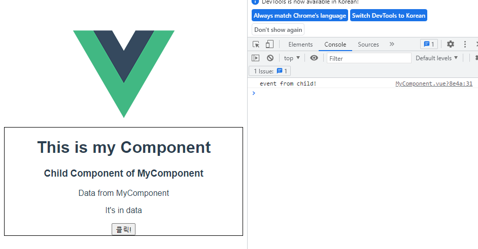
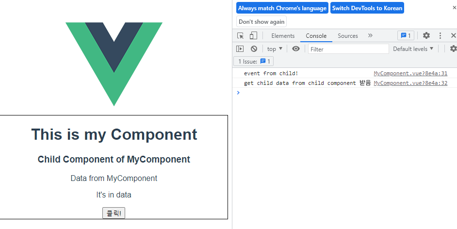

# Emit Event

## Emit Event 개요

✔ 부모 컴포넌트에서 자식 컴포넌트로 데이터를 전달할 때는 **이벤트를 발생** 시킨다.

1. 데이터를 **이벤트 리스터의 콜백함수 인자**로 전달
2. 상위 컴포넌트는 **해당 이벤트를 통해 데이터를 받음**

## Emit Event 기초

```vue
<!-- MyComponentItem.vue -->

<template>
  <div>
    ...
    <button @click="childToParent">클릭!</button>
  </div>
</template>

<script>
export default {
  ...
  methods: {
    childToParent: function () {
      this.$emit("child-to-parent");
    },
  },
};
</script>

<style></style>
```

```vue
<!-- MyComponent.vue -->

<template>
  <div class="border">
    <h1>This is my Component</h1>
    <MyComponentItem ... @child-to-parent="parentGetEvent" />
  </div>
</template>

<script>
...
export default {
  ...
  methods: {
    parentGetEvent: function () {
      console.log("event from child!");
    },
  },
};
</script>
```



### 흐름 정리

1. 자식 컴포넌트에 있는 버튼 클릭 이벤트를 청취하여 연결된 핸들러 함수(`childToParent`) 호출
2. 호출된 함수에서 `$emit`을 통해 상위 컴포넌트에 이벤트(`child-to-parent`) 발생
3. 상위 컴포넌트는 자식 컴포넌트가 발생시킨 이벤트(`child-to-parent`)를 청취하여 연결된 핸들러 함수(`parentGetEvent`) 호출

## Emit with Data

```vue
<!-- MyComponentItem.vue -->

<template>
  <div>
    ...
    <button @click="childToParent">클릭!</button>
  </div>
</template>

<script>
export default {
  ...
  methods: {
    childToParent: function () {
      this.$emit("child-to-parent", "child data");
    },
  },
};
</script>

<style></style>
```

✔ 이벤트를 발생(emit) 시킬 때 인자로 데이터를 전달!

```vue
<!-- MyComponent.vue -->

<template>
  <div class="border">
    <h1>This is my Component</h1>
    <MyComponentItem ... @child-to-parent="parentGetEvent" />
  </div>
</template>

<script>
...
export default {
  ...
  methods: {
    parentGetEvent: function (inputData) {
      console.log("event from child!");
      console.log(`get ${inputData} from child component 받음`);
    },
  },
};
</script>
```

✔ 전달한 데이터는 이벤트와 연결된 부모 컴퍼넌트의 핸들러 함수의 인자로 사용 가능



### 흐름 정리

1. 자식 컴포넌트에 있는 버튼 클릭 이벤트를 청취하여 연결된 핸들러 함수(`ChildToParent`)호출
2. 호출된 함수에서 `$emit`을 통해 부모 컴포넌트에 이벤트(`child-to-parent`)를 발생 (이벤트에 데이터(`child data`)함께 전달)
3. 부모 컴포넌트는 자식 컴포넌트의 이벤트(`child-to-parent`)를 청취하여 연결된 핸들러 함수(`parentGetEvent`)호출, 함수의 인자로 전달된 데이터(`child data`)가 포함
4. 호출된 함수에서 `console.log(~child data~)`실행

## emit dynamic data

```vue
<!-- MyComponentItem.vue -->

<template>
  <div>
    ...
    <button @click="childInput">클릭!</button>
    <input type="text" v-model="childInputData" />
  </div>
</template>

<script>
export default {
  ...
  methods: {
    childInput: function () {
      this.$emit("child-input", this.childInputData);
    },
  },
};
</script>

<style></style>
```

```vue
<!-- MyComponent.vue -->

<template>
  <div class="border">
    <h1>This is my Component</h1>
    <MyComponentItem ... @child-input="getDynamicData" />
  </div>
</template>

<script>
...
export default {
  ...
  data: function () {
    return {
      dynamicProps: "It's in data",
    };
  },
  methods: {
    getDynamicData: function (inputData) {
      console.log(12);
      console.log(`get dynamic ${inputData} from child component`);
    },
  },
};
</script>
```

### 흐름 정리

1. 자식 컴포넌트에 있는 버튼 클릭 이벤트를 청취하여 연결된 핸들러 함수(`ChildInput`)호출
2. 호출된 함수에서 `$emit`을 통해 부모 컴포넌트에 이벤트(`child-input`)를 발생 (이벤트에 v-modle로 바인딩 된 입력받은 데이터 전달)
3. 부모 컴포넌트는 자식 컴포넌트의 이벤트(`child-input`)를 청취하여 연결된 핸들러 함수(`getDynamicData`)호출, 함수의 인자로 전달된 데이터가 포함
4. 호출된 함수에서 `console.log(~입력받은 데이터~)`실행

## pass props / emit event 컨벤션

✔ HTML 요소에서 사용할 때는 kebab-case  
✔ JavaScript에서 사용할 때는 camelCase

✔ props

- 상위 -> 하위 흐름에서 HTML 요소로 내려줄 때: kebab-case
- 하위에서 받을 때 JavaScript에서 받음: camelCase

✔ emit

- emit 이벤트를 발생시키면 HTML 요소가 이벤트를 청취: kebab-case
- 메서드, 변수명 등은 JavaScript에서 사용: camelCase
