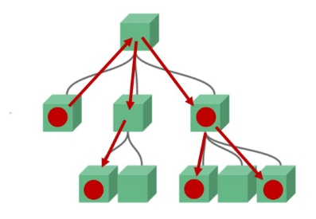
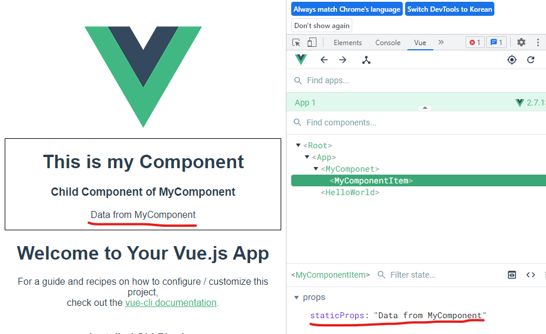
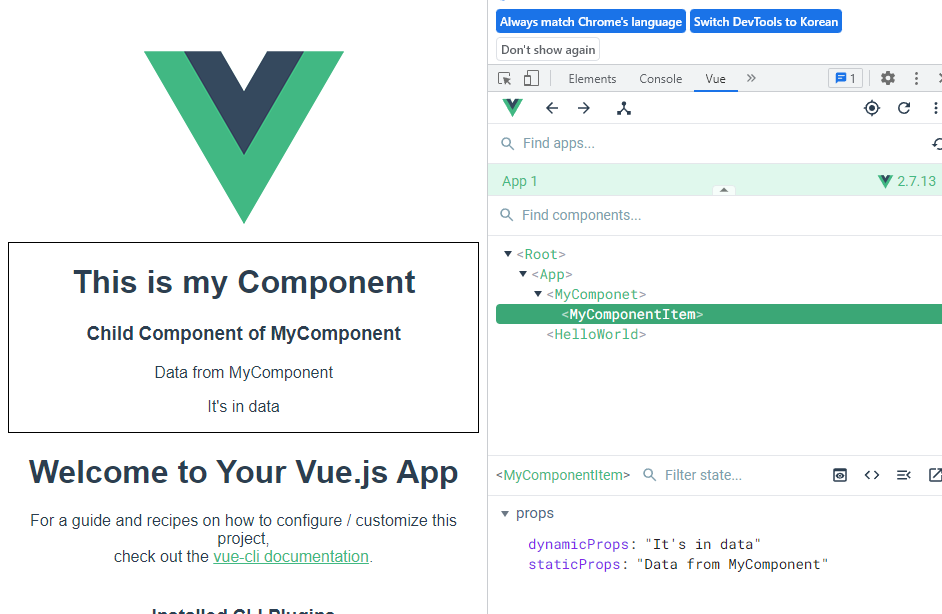

# Pass Props

## Data in components

### Data in components 개요



✔ 완전히 동일한 data를 서로 다른 Component에서 보여주는 방법?!  
✔ 컴포넌트는 부모-자식 관계를 가지고 있으므로, 부모-자식 관계만 데이터를 주고 받게 설정!  
✔ 데이터 흐름 파악 용이  
✔ 유지 보수 용이

### pass props & emit event

✔ 부모 -> 자식으로의 데이터 흐름

- **pass props**

✔ 자식 -> 부모로의 데이터 흐름

- **emit event**

## Pass Props

### 개요

✔ 요소의 속성(property)를 사용하여 데이터 전달  
✔ props는 부모(상위) 컴포넌트의 정보를 전달하기 위한 사용자 지정 특성  
✔ 자식(하위) 컴포넌트는 porps 옵션을 사용하여 수신하는 props를 명시적으로 선언

### props in HelloWorld

```vue
<!-- HelloWorld.vue -->

<template>
  <div class="hello">
    <h1>{{ msg }}</h1>
    ...
  </div>
</template>
```

```vue
<!-- HelloWorld.vue -->

<script>
export default {
  name: "HelloWorld",
  props: {
    msg: String,
  },
};
</script>
```

✔ Vue CLI를 설치할 때 만들어주던 App.vue의 HelloWorld 컴포넌트를 살펴보면 msg라는 property 작성되어 있음

✔ App.vue의 `<HelloWorld/>`요소에 `msg="~"`라는 porperty를 설정하였고, 하위 컴포넌트인 HelloWorld는 자신에게 부여된 msg property를 template에서 {{ msg }} 형태로 사용

### Pass Props

✔ 위와 같은 부모 => 자식으로의 data 전달 방식  
✔ 정적인 데이터를 전달하는 경우 static props라고 명시  
✔ 요소에 속성을 작성하듯이 사용 가능하여, `prop-data-name="value"`의 형태로 데이터를 전달

- 이때 **속성의 키 값은 kebab-case**를 사용

```vue
<!-- HelloWorld.vue -->

<script>
export default {
  name: "HelloWorld",
  props: {
    msg: String,
  },
};
</script>
```

✔ **Props 명시**: 데이터를 받는 쪽, 즉 **하위 컴포넌트에서도 props에 대해 명시적으로 작성**을 해주어야 한다.  
✔ 전달 받은 props를 type과 함께 명시  
✔ 컴포넌트를 문서화할 뿐만 아니라, 잘못된 타입이 전달되는 경우 브라우저의 자바스크립트 콘솔에서 사용자에게 경고를 보냄

### MyComponent to MyComponentItem

```vue
<!-- MyComponent.vue -->

<template>
  <div class="border">
    <h1>This is my Component</h1>
    <!-- 데이터 보내주기 -->
    <MyComponentItem static-props="Data from MyComponent" />
  </div>
</template>
```

```vue
<!-- MyComponentItem.vue -->

<template>
  <div>
    <h3>Child Component of MyComponent</h3>
    <p>{{ staticProps }}</p>
  </div>
</template>

<script>
export default {
  name: "MyComponentItem",
  props: {
    staticProps: String,
  },
};
</script>
```



### Pass Props convention

✔ 부모에서 넘겨주는 props(HTML)

- **kebab-case**

✔ 자식에서 받는 props

- **camelCase**

### Dynamic Props

✔ 변수를 props로 전달할 수 있음  
✔ v-bind directive를 사용해 데이터를 동적으로 바인딩  
✔ 부모 컴포넌트의 데이터가 업데이트 되면 자식 컴포넌트로 전달되는 데이터 또한 업데이트 됨

### Dynamic Props 실습

```vue
<!-- MyComponent.vue -->

<template>
  <div class="border">
    <h1>This is my Component</h1>
    <MyComponentItem
      static-props="Data from MyComponent"
      <!-- 동적 데이터 -->
      :dynamic-props="dynamicProps"
    />
  </div>
</template>

<script>
export default {
  ...
  data: function () {
    return {
      dynamicProps: "It's in data",
    };
  },
};
</script>
```

```vue
<!-- MyComponentItem.vue -->

<template>
  <div>
    <h3>Child Component of MyComponent</h3>
    <p>{{ staticProps }}</p>
    <p>{{ dynamicProps }}</p>
  </div>
</template>

<script>
export default {
  name: "MyComponentItem",
  props: {
    staticProps: String,
    dynamicProps: String,
  },
};
</script>
```



### 컴포넌트의 data 함수

✔ 각 vue 인스턴스는 같은 data 객체를 공유하므로 **새로운 data 객체를 반환(return)하여 사용**해야 한다!

### Dynamic Props 주의사항

✔ `:dynamic-props="dynamicProps"`는 앞의 key값 (dynamic-props)이란 이름으로 뒤의 " "안에 오는 데이터(dynamicProps)를 전달하겠다는 뜻

✔ v-bind로 묶여있는 " "안의 구문은 javascript 구문으로 볼 수 있다.  
✔ `dynamicProps`라고 하는 변수에 대한 data를 전달 할 수 있는 것!!

```vue
<!-- 1: static: 문자열 '1' 전달 -->
<SomeComponent num-props="1" />

<!-- 2: static: 숫자 '1' 전달 -->
<SomeComponent :num-props="1" />
```

### 단방향 데이터 흐름

✔ 모든 props는 부모에서 자식으로, 즉 아래로 **단방향 바인딩**을 형성  
✔ 부모 속성이 업데이트 되면 자식으로 흐르지만 반대 방향은 아니다!

- 부모 컴포넌트가 업데이트 될 때마다 자식 컴포넌트의 모든 props가 최신 값으로 새로 고침됨

✔ 하위 컴포넌트가 상위 컴포넌트의 상태를 변경하여 앱의 데이터 흐름을 이해하기 힘들게 하는 것 방지!
