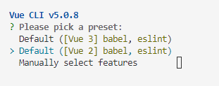

# Vue CLI

## Node.js

✔ 자바스크립트는 브라우저를 조작하는 유일한 언어 -> 브라우저 밖에서는 구동할 수 없었다!  
✔ **브라우저가 아닌 환경에서도 구동할 수 있도록 하는 런타임 환경**

### NPM (Node Package Manage)

✔ 자바스크립트 패키지 관리자

## Vue CLI 개요

✔ Vue 개발을 위한 표준 도구  
✔ 프로젝트의 구성을 도와주는 역할  
✔ 확장 플러그인, GUI, Bable 등 다양한 툴 제공

## Vue CLI 시작하기

1. 설치  
   `$npm install -g @vue/cli`
2. 프로젝트 생성  
   `$vue create <프로젝트명>`
3. 프리셋 설정  
   
4. 디렉토리 이동  
   `cd <프로젝트 명>`
5. 서버 가동  
   `npm run serve`  
     
   

## Vue CLI 프로젝트 구조

### `node_modules`

✔ node.js 환경의 여러 **의존성 모듈**  
✔ python의 venv와 비슷한 역할  
-> **`.gitignore`에 추가하기!!**

### Module

✔ 개발하는 어플리케이션의 크기가 커지고 복잡해지면 파일 하나에 모든 기능을 담기가 어려워짐  
✔ 따라서 **자연스럽게 파일을 여러개로 분리하여 관리**를 하고, 이때 **분리된 파일 각각이 모듈(module)**  
✔ 대부분 **기능 단위로 분리**하며, 클래스 하나 혹은 특정한 목적을 가진 복수의 함수로 구성된 라이브러리 하나로 구성됨

### Module 의존성 문제

✔ 모듈의 수가 많아지고 라이브러리 혹은 모듈 간의 **의존성(연결성)이 깊어지면서 특정한 곳에서 발생한 문제가 어떤 모듈 간의 문제인지 파악하기 어렵다**.  
✔ **Webpack** 등장!

### Bundler

✔ **Bundling**: **모듈 의존성 문제를 해결해주는 작업**  
✔ bundling을 해주는 도구가 Bundler이고, Webpack은 다양한 Bundler 중 하나!!  
✔ **모듈을 하나로 묶어주고 묶인 파일은 하나(혹은 여러 개)로 만들어진다.**  
✔ Bundling된 결과물을 개별 모듈의 실행 순서에 영향을 받지 않고 동작!  
✔ **Vue CLi는 이러한 Babel, Webpack에 대한 초기 설정이 자동으로 되어있다!!**

### Webpack - static module bundler

✔ 의존성을 Webpack이 담당해주므로 개발자는 npm install을 사용해 다양한 모듈을 한 번에 설치하고 각 모듈을 사용해 개발에 집중할 수 있다.

### `package.json`

✔ 프로젝트의 종속성 목록과 지원되는 브라우저에 대한 구성 옵션을 포함

### `package-lock.json`

✔ node_modules에 설치되는 모듈과 관련된 모든 의존성을 설정 및 관리  
✔ python의 requirements.txt 역할!

### `public/index.html`

✔ Vue 앱의 뼈대가 되는 html 파일  
✔ Vue 앱과 연결될 요소가 있음

### src

✔ `src/assets`

- 정적 파일을 저장하는 디렉토리

✔ `src/components`

- 하위 컴포넌트들이 위치

✔ `src/APP.vue`

- 최상위 컴포넌트
- `public/index.html`과 연결된다.

✔ `src/main.js`

- webpack이 빌드를 시작할 때 가장 먼저 불러오는 entry point
- Vue 전역에서 활용 할 모듈을 등록할 수 있는 파일
