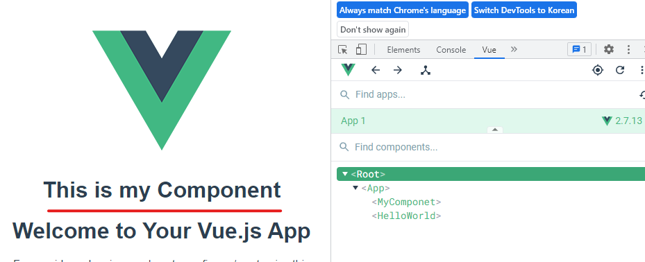

# Vue Component

## Vue Component 구조

```vue
<template>
  <div id="app">
    
    <HelloWorld msg="Welcome to Your Vue.js App" />
  </div>
</template>

<script>
import HelloWorld from "./components/HelloWorld.vue";

export default {
  name: "App",
  components: {
    HelloWorld,
  },
};
</script>

<style>
#app {
  font-family: Avenir, Helvetica, Arial, sans-serif;
  -webkit-font-smoothing: antialiased;
  -moz-osx-font-smoothing: grayscale;
  text-align: center;
  color: #2c3e50;
  margin-top: 60px;
}
</style>
```

✔ 템플릿(HTML)

- HTML의 body 부분
- 눈으로 보여지는 요소 작성
- 다른 컴포넌트를 html요소 처럼 추가 가능

✔ 스크립트(JavaScript)

- JavaScript 코드가 작성되는 곳
- 컴포넌트 정보, 데이터, 메서드 등 vue 인스턴스를 구성하는 대부분이 작성된다.

✔ 스타일(CSS)

- CSS가 작성되며 컴포넌트의 스타일을 담당

### 구조 정리

✔ 컴포넌트들이 tree 구조를 이루어 하나의 페이지를 만든다.  
✔ root에 해당하는 최상단의 component가 `App.vue`  
✔ 이 App.vue를 index.html과 연결  
✔ 하나의 페이지만들 rendering -> SPA

## Vue component 실습

### MyComponentj.vue

```vue
// MyComponent.vue

<template>
  <div>
    <h1>This is my Component</h1>
  </div>
</template>

<script>
export default {
  name: "MyComponet",
};
</script>

<style></style>
```

1. `src/components/` 안에 생성
2. script에 이름 등록
3. template에 요소 추가

### component 등록 3단계

```vue
<template>
  <div id="app">
    
    <!-- 3. 보여주기 -->
    <MyComponent />
    <HelloWorld msg="Welcome to Your Vue.js App" />
  </div>
</template>

<script>
import HelloWorld from "./components/HelloWorld.vue";
// 1. 불러오기
// import MyComponent from './components/MyComponent.vue'
import MyComponent from "@/components/MyComponent";

export default {
  name: "App",
  components: {
    HelloWorld,
    // 2. 등록하기
    MyComponent,
  },
};
</script>
```

1. 불러오기  
   ✔ `import {instance name} from {위치}`  
   ✔ `@`는 src의 shortcut  
   ✔ `.vue`는 생략 가능

2. 등록하기

3. 보여주기



## 자식 컴포넌트 작성

1. `src/components/` 안에 `MyComponentItem.vue` 생성

```vue
<!-- MyComponentItem.vue -->

<template>
  <div>
    <h3>Child Component of MyComponent</h3>
  </div>
</template>

<script>
export default {
  name: "MyComponentItem",
};
</script>

<style></style>
```

2. MyComponent에 MyChild 등록

```vue
// MyComponent.vue

<template>
  <div class="border">
    <h1>This is my Component</h1>
    <!-- 3. 보여주기 -->
    <MyComponentItem />
  </div>
</template>

<script>
// 1. 불러오기
import MyComponentItem from "@/components/MyComponentItem";

export default {
  name: "MyComponet",
  // 2. 등록하기
  components: {
    MyComponentItem,
  },
};
</script>

<style>
.border {
  border: solid 1px black;
}
</style>
```
