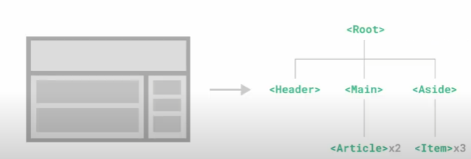

# SFC

## Component

### Component 개요

✔ UI를 독립적이고 재사용 가능한 조각들로 나눈 것

- 즉 기능별로 분화한 코드 조각

✔ CS에서는 **다시 사용할 수 있는 범용성을 위해 개발된 소프트웨어 구성 요소**를 의미  
✔ 하나의 app을 구성할 때 **중첩된 컴포넌트들의 tree를 구성**하는 것이 보편적!  
✔ **유지보수를 용이, 재사용성 향상**

### Component based architecture의 특징

✔ 관리 용이  
✔ 재사용성  
✔ 확장 가능  
✔ 캡슐화  
✔ 독립적

## Component in Vue

✔ **이름이 있는 재사용 가능한 Vue instance**  
✔ `new Vue()`

## SFC(Single File Component)

✔ 하나의 `.vue`파일이 하나의 Vue instace이고, 하나의 컴포넌트!  
✔ Vue instance에서는 HTMl, CSS, JavaScript 코드를 한번에 관리
