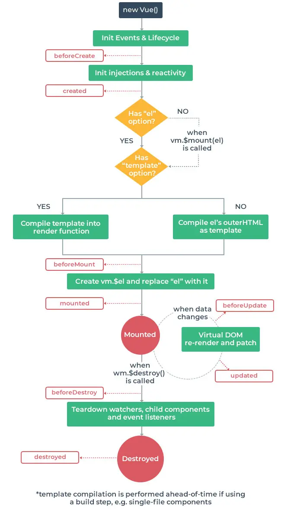

# Lifecycle Hooks

## 개요

✔ 각 Vue 인스턴스는 생성과 소멸의 과정 중 단계별 초기화 과정을 거침

- Vue 인스턴스가 생성된 경우, 인스턴스 DOM에 마운트하는 경우, 데이터가 변경되어 DOM을 업데이트 하는 경우 등

✔ 각 단계가 트리거가 되어 특정 로직을 실행할 수 있음  
✔ 이를 lifecycle hook이라 한다



## Lifecycle Hooks

### created

✔ Vue instance가 생성된 후 호출됨  
✔ data, computed등의 설정이 완료된 상태  
✔ 서버에서 받은 데이터를 vue instance의 data에 할당하는 로직을 구현하기에 적합  
✔ 단, mount되지 않아 요소에 접근할 수 없음

```javascript
export default {
  ...
  created() {
    this.getDogImage()
  },
}
```

✔ 버튼 누르기 전에 첫 실행 시 기본 사진 출력

### mounted

```javascript
export default {
  ...
  mounted() {
    const button = document.querySelector('button')
    button.innerText ='멍멍!'
  }
}
```

✔ Vue instance가 요소에 mount된 후 호출  
✔ mount된 요소 조작 가능

### updated

```javascript
export default {
  ...
  updated() {
    console.log('새로운 도그')
  }
}
```

✔ 데이터가 변경되어 DOM에 변화를 줄 때 호출

### Lifecycle Hooks의 특징

✔ Lifecycle Hooks는 컴포넌트 별로 정의할 수 있음  
✔ 부모 컴포넌트의 mounted hook이 실행되었다고 해서 자식이 mount 된 것이 아니고, 부모 컴포넌트가 updated hook이 실행되었다고 해서 자식이 updated된 것도 아니다

- 부착 여부가 부모 -자식 관계에 따라 순서를 가지고 있지 않다!

✔ **instance마다 각각의 Lifecycle을 가진다**
