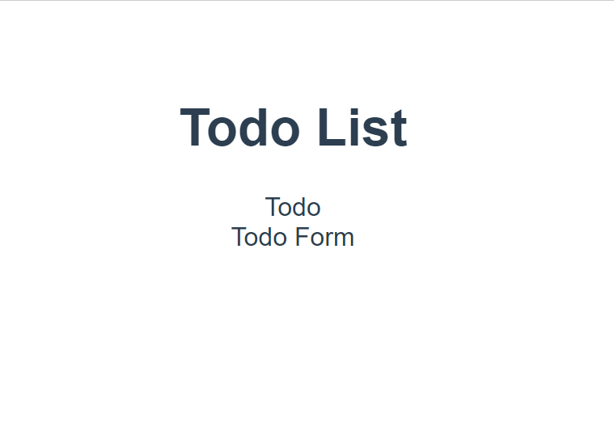
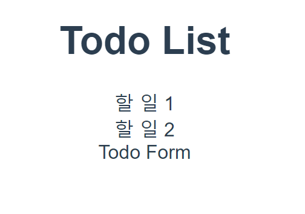
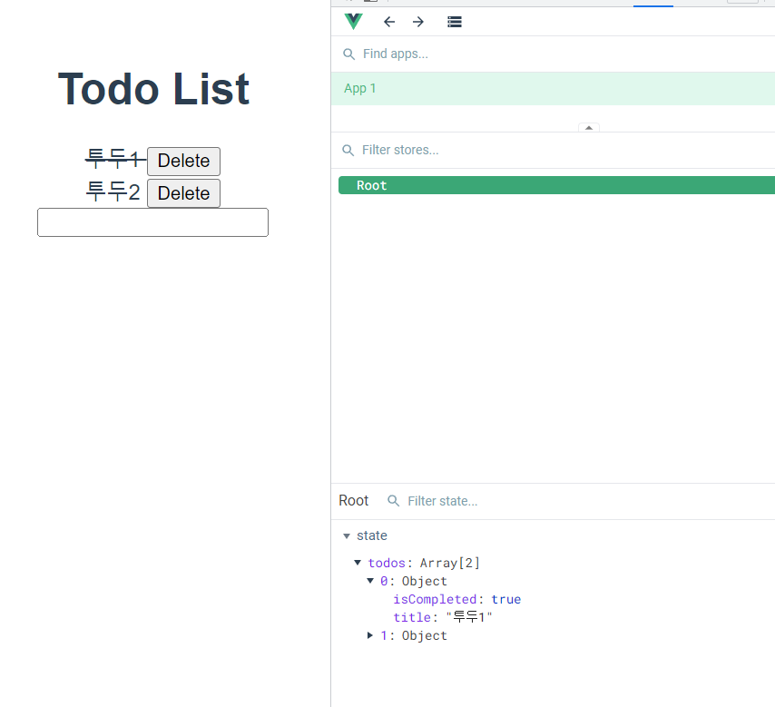
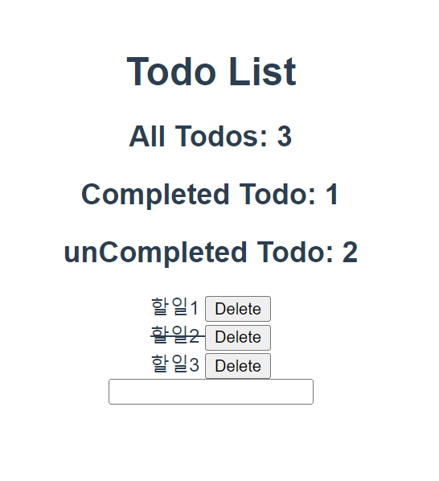

# Todo

## 사전 준비

### 프로젝트 개시

1. 프로젝트 생성 및 vuex 플러그인 추가

```shell
$ vue create todo-vuex-app
$ cd todo-vuex-app
$ vue add vuex
```

2. HelloWorld 컴포넌트 및 관련 코드 삭제

### 컴포넌트 작성

```vue
// components/TodoListItem.vue

<template>
  <div>Todo</div>
</template>

<script>
export default {
  name: "TodoListItem",
};
</script>

<style></style>
```

```vue
// components/TodoList.vue

<template>
  <div>
    <TodoListItem />
  </div>
</template>

<script>
import TodoListItem from "./TodoListItem.vue";

export default {
  name: "TodoList",
  components: {
    TodoListItem,
  },
};
</script>

<style></style>
```

```vue
// components/TodoForm.vue

<template>
  <div>Todo Form</div>
</template>

<script>
export default {
  name: "TodoForm",
};
</script>

<style></style>
```

```vue
// App.vue

<template>
  <div id="app">
    <h1>Todo List</h1>
    <TodoList />
    <TodoForm />
  </div>
</template>

<script>
import TodoForm from "./components/TodoForm.vue";
import TodoList from "./components/TodoList.vue";

export default {
  name: "App",
  components: {
    TodoList,
    TodoForm,
  },
};
</script>
```

### 페이지 확인



## Read Todo

### State 세팅

```javascript
// index.js

import Vue from 'vue'
import Vuex from 'vuex'

Vue.use(Vuex)

export default new Vuex.Store({
  state: {
    todos: [
      {
        title: '할 일 1',
        isCompleted: false,
      },
      {
        title: '할 일 2',
        isCompleted: false,
      }
    ]
  },
  ...
})
```

### state 데이터 가져오기

```vue
// components/TodoList.vue

<template>
  <div>
    <TodoListItem v-for="(todo, index) in todos" :key="index" :todo="todo" />
  </div>
</template>

<script>
import TodoListItem from "./TodoListItem.vue";

export default {
  name: "TodoList",
  components: {
    TodoListItem,
  },
  computed: {
    todos() {
      return this.$store.state.todos;
    },
  },
};
</script>

<style></style>
```

### Pass Props

```vue
// components/TodoListItem.vue

<template>
  <div>{{ todo.title }}</div>
</template>

<script>
export default {
  name: "TodoListItem",
  props: {
    todo: Object,
  },
};
</script>

<style></style>
```



## Create Todo

### TodoForm, Actions

```vue
// components/TodoForm.vue

<template>
  <div>
    <input type="text" v-model="todoTitle" @keyup.enter="createTodo" />
  </div>
</template>

<script>
export default {
  name: "TodoForm",
  data() {
    return {
      todoTitle: null,
    };
  },
  methods: {
    createTodo() {
      // console.log(this.todoTitle)
      this.$store.dispatch("createTodo", this.todoTitle);
      this.todoTitle = null;
    },
  },
};
</script>
```

✔ todoTitle을 입력 받을 input 태그 생성  
✔ todoTitle을 저장하기 위해 data를 정의하고 input과 v-model을 이용해 양방향 바인딩  
✔ enter 이벤트를 사용해 createTodo 메서드 출력 확인  
<br>
✔ createTodo 메서드에서 actions를 호출(dispatch)

### Mutations

```javascript
// index.js

export default new Vuex.Store({
  ...
  actions: {
    createTodo(context, todoTitle) {
      // Todo 객체 만들기
      const todoItem = {
        title: todoTitle,
        isCompleted: false,
      };
      // console.log(todoItem)
      context.commit('CREATE_TODO', todoItem)
    },
  },
  modules: {},
});
```

✔ CREATE_TODO mutations 메서드에 todoItem을 전달하며 호출(commit)

```javascript
// index.js

export default new Vuex.Store({
  ...
  mutations: {
    CREATE_TODO(state, todoItem) {
      state.todos.push(todoItem)
    }
  },
  ...
});
```

✔ mutations에서 state의 todos에 접근해 배열에 요소 추가

```javascript
export default new Vuex.Store({
  state: {
    todos: [],
  },
  ...
})
```

✔ 기존 dummy data 삭제

## 중간 정리!

✔ Vue 컴포넌트의 method에서 dispatch를 사용해 actions 메서드 호출  
✔ Actions에 정의된 함수는 commit()를 사용해 mutations 호출  
✔ Mutations에 정의된 함수가 최종적으로 state 변경

## Delete Todo

### TodoListItem

```vue
// components/TodoListItem.vue

<template>
  <div>
    {{ todo.title }}
    <button @click="deleteTodo">Delete</button>
  </div>
</template>

<script>
export default {
  name: "TodoListItem",
  props: {
    todo: Object,
  },
  method: {
    deleteTodo() {
      this.$store.dispatch("deleteTodo");
    },
  },
};
</script>
```

✔ TodoListItem 컴포넌트에 삭제 버튼 및 deleteTodo 메서드 작성

### Actions

```javascript
export default new Vuex.Store({
  ...
  actions: {
    createTodo(context, todoTitle) {
      // Todo 객체 만들기
      const todoItem = {
        title: todoTitle,
        isCompleted: false,
      };
      // console.log(todoItem)
      context.commit('CREATE_TODO', todoItem)
    },

    // 이 경우는 생략하고 바로 mutations 호출 가능
    deleteTodo(context, todoItem) {
      context.commit('DELETE_TODO', todoItem)
    },
  },
  modules: {},
});
```

✔ 이 경우는 따로 기능이 없기 때문에 바로 mutations로 호출이 가능하다

### Mutations

```javascript
export default new Vuex.Store({
  ...
  mutations: {
    CREATE_TODO(state, todoItem) {
      state.todos.push(todoItem)
    },
    DELETE_TODO(state, todoItem) {
      const index = state.todos.indexOf(todoItem)
      state.todos.splice(index, 1)
    }
  },
})
```

✔ 전달될 때 todoItem에 해당하는 todo 삭제

## Update Todo

### TodoListItem

```vue
// components/TodoListItem.vue

<template>
  <div>
    <span @click="updateTodoStatus">
      {{ todo.title }}
    </span>
    <button @click="deleteTodo">Delete</button>
  </div>
</template>

<script>
export default {
  name: 'TodoListItem',
  props: {
    todo: Object,
  },
  methods: {
    ...
    updateTodoStatus() {
      this.$store.dispatch('updateTodoStatus', this.todo)
    }
  },
}
</script>
```

### Actions

```javascript
// index.js

export default new Vuex.Store({
  ...
  actions: {
    ...
    updateTodoStatus(context, todoItem) {
      context.commit('UPDATE_TODO_STATUS', todoItem)
    }
  },
  modules: {},
});
```

### Mutations

```javascript
export default new Vuex.Store({
  ...
  mutations: {
    ...
    UPDATE_TODO_STATUS(state, todoItem) {
      // console.log(todoItem)
      state.todos = state.todos.map((todo) => {
        if (todo === todoItem) {
          todo.isCompleted = !todo.isCompleted
        }
        return todo
      })
    }
  },
  ...
});
```

✔ map 메서드 활용해 선택된 todo의 isCompleted를 반대로 변경 후 기존 배열 업데이트

### 취소선 스타일링

```vue
// components/TodoListItem.vue

<template>
  <div>
    <span 
      @click="updateTodoStatus"
      :class="{ 'is-completed' : todo.isCompleted }"
      >
      {{ todo.title }}
    </span>
  <button @click="deleteTodo">Delete</button>
  </div>
</template>

<script>
export default {
  name: 'TodoListItem',
  props: {
    todo: Object,
  },
  methods: {
    deleteTodo() {
      this.$store.dispatch('deleteTodo', this.todo)
    },
    updateTodoStatus() {
      this.$store.dispatch('updateTodoStatus', this.todo)
    }
  },
}
</script>

<style>
  .is-completed {
    text-decoration: line-through;
  }
</style>
```

✔ CSS 작성 후 v-bind 활용해 isCompleted 값에 따라 css 클래스가 토글 방식으로 적용되도록 작성

### 동작 확인


## 상태별 todo 개수 계산

### 전체 todo 개수 
```javascript
export default new Vuex.Store({
  state: {
    todos: [],
  },
  getters: {
    allTodosCount(state) {
      return state.todos.length
    }
  },
  ...
})
```
✔ `allTodosCount` getters 작성  
✔ state에 있는 todos 배열의 길이 계산

```vue
// App.vue

<template>
  <div id="app">
    <h1>Todo List</h1>
    <h2>All Todos: {{ allTodosCount }}</h2>
    <TodoList/>
    <TodoForm/>
  </div>
</template>

<script>
import TodoForm from './components/TodoForm.vue'
import TodoList from './components/TodoList.vue'

export default {
  name: 'App',
  components: {
    TodoList,
    TodoForm
  },
  computed: {
    allTodosCount() {
      return this.$$store.getters.allTodosCount
    }
  },
}
</script>
```

✔ getters에 계산된 값을 각 컴포넌트의 computed에서 사용하기

### 완료된 todo 개수

```javascript
// index.js

export default new Vuex.Store({
  state: {
    todos: [],
  },
  getters: {
    allTodosCount(state) {
      return state.todos.length
    },
    completedTodosCount(state) {
      // 1. 완료된 todo만 모아 놓은 새로운 객체 생성
      const completedTodos = state.todos.filter((todo) => {
        return todo.isCompleted == true
      })
      // 2. 길이 반환
      return completedTodos.length
    },
  },
}
```

✔ `completedTodosCount` getters 작성  
✔ isCompleted가 true 인 todo들만 필터링한 배열을 만들고 길이 계산

```vue
// App.vue

<template>
  <div id="app">
    <h1>Todo List</h1>
    <h2>All Todos: {{ allTodosCount }}</h2>
    <h2>Completed Todo: {{ completedTodosCount }}</h2>
    <TodoList/>
    <TodoForm/>
  </div>
</template>

<script>
import TodoForm from './components/TodoForm.vue'
import TodoList from './components/TodoList.vue'

export default {
  name: 'App',
  components: {
    TodoList,
    TodoForm
  },
  computed: {
    allTodosCount() {
      return this.$store.getters.allTodosCount
    },
    completedTodosCount() {
      return this.$store.getters.completedTodosCount
    }
  },
}
</script>
```

### 미완료된 todo 개수

```javascript
// index.js

export default new Vuex.Store({
  state: {
    todos: [],
  },
  getters: {
    ...
    unCompletedTodosCount(state, getters) {
      return getters.allTodosCount - getters.completedTodosCount
    }
  },
})
```

✔ 미완료된 todo 개수 === 전체 개수 - 완료 개수  
✔ getters 가 두번째 인자로 getters 받는 것 활용

```vue
// App.vue

<template>
  <div id="app">
    <h1>Todo List</h1>
    <h2>All Todos: {{ allTodosCount }}</h2>
    <h2>Completed Todo: {{ completedTodosCount }}</h2>
    <h2>unCompleted Todo: {{ unCompletedTodosCount }}</h2>
    <TodoList/>
    <TodoForm/>
  </div>
</template>

<script>
import TodoForm from './components/TodoForm.vue'
import TodoList from './components/TodoList.vue'

export default {
  name: 'App',
  components: {
    TodoList,
    TodoForm
  },
  computed: {
    allTodosCount() {
      return this.$store.getters.allTodosCount
    },
    completedTodosCount() {
      return this.$store.getters.completedTodosCount
    },
    unCompletedTodosCount() {
      return this.$store.getters.unCompletedTodosCount
    }
  },
}
</script>
```

### 동작 확인
