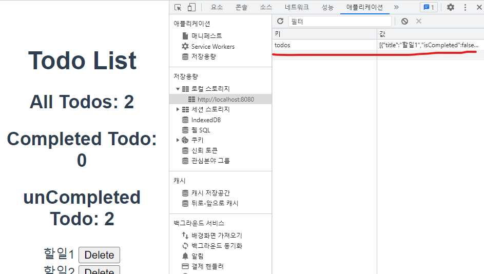
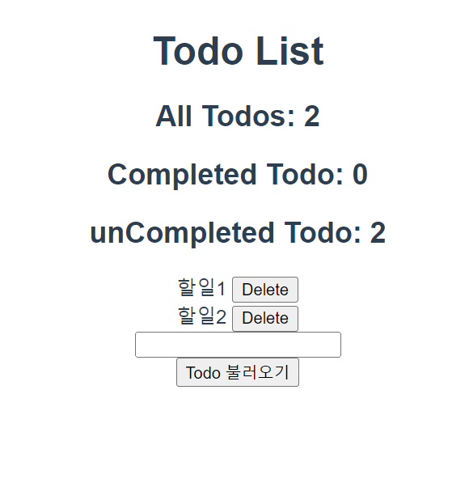

# Todo: Local Storage

## Local Storage 개요
✔ 브라우저의 Local Storage에 todo 데이터를 저장하여 브라우저를 종료하고 다시 실행해도 데이터가 보존될 수 있도록 하기  

## `Window.localStorage`
✔ 브라우저에서 제공하는 저장공간 중 하나인 Local Storage에 관련된 속성  
✔ 만료되지 않은 브라우저를 종료하고 다시 실행해도 데이터가 보존된다.  
✔ 데이터 문자열 형태로 저장  
✔ 관련 메서드
- `setItem(key, value)`: key, value 형태로 데이터 저장
- `getItem(key)`: key에 해당하는 데이터 조회

## Local Storage 실습

1. 실습

```javascript
// index.js

export default new Vuex.Store({
  ...
  actions: {
    ...
    saveTodosToLocalStorage(context) {
      const jsonTodos = JSON.stringify(context.state.todos)
      localStorage.setItem('todos', jsonTodos)
    }
  },
  modules: {},
});
```

✔ 데이터가 문자열 형태로 저장되어야 하기 때문에 `JSON.stringify`를 사용해 문자열 형태로 변환해주는 과정 필요  
✔ state를 변경하는 작업이 아니기 때문에 mutations이 아닌 actions에 작성

2. 실습
   
```javascript
// index.js

export default new Vuex.Store({
  ...
  actions: {
    createTodo(context, todoTitle) {
      // Todo 객체 만들기
      const todoItem = {
        title: todoTitle,
        isCompleted: false,
      };
      // console.log(todoItem)
      context.commit('CREATE_TODO', todoItem)
      context.dispatch('saveTodosToLocalStorage')
    },

    // 이 경우는 생략하고 바로 mutations 호출 가능
    deleteTodo(context, todoItem) {
      context.commit('DELETE_TODO', todoItem)
      context.dispatch('saveTodosToLocalStorage')
    },
    
    updateTodoStatus(context, todoItem) {
      context.commit('UPDATE_TODO_STATUS', todoItem)
      context.dispatch('saveTodosToLocalStorage')
    },

    saveTodosToLocalStorage(context) {
      const jsonTodos = JSON.stringify(context.state.todos)
      localStorage.setItem('todos', jsonTodos)
    }
  },
  modules: {},
});
```

✔ todo 생성, 삭제, 수정 시에 모두 `saveTodosToLocalStorage` action 메서드가 실행되도록 함

3. 실습


✔ local storage에 저장된 것 확인  

4. 실습
   
✔ 아직 Local Storage에 있는 todo목록을 불러온 것이 아니기 때문에 불러오기 버튼을 통해 저장된 데이터를 가져오도록 해야 한다.  

5. 불러오기 버튼 작성

```vue
// App.vue

<template>
  <div id="app">
    <h1>Todo List</h1>
    <h2>All Todos: {{ allTodosCount }}</h2>
    <h2>Completed Todo: {{ completedTodosCount }}</h2>
    <h2>unCompleted Todo: {{ unCompletedTodosCount }}</h2>
    <TodoList/>
    <TodoForm/>
    <button @click="loadTodos">Todo 불러오기</button>
  </div>
</template>
```

6. `loadTodos` 메서드 작성

```vue
// App.vue

<script>
import TodoForm from './components/TodoForm.vue'
import TodoList from './components/TodoList.vue'

export default {
  name: 'App',
  components: {
    TodoList,
    TodoForm
  },
  methods: {
    loadTodos() {
      this.$store.dispatch('loadTodos')
    }
  },
...
}
```

7. `loadTodos` actions 메서드 작성

```javascript
// index.js

export default new Vuex.Store({
  ...
  actions: {
    ...
    loadTodos(context) {
      context.commit('LOAD_TODOS')
    }
  },
  modules: {},
});

```

8. `LOAD_TODOS` mutation 메서드 작성

```javascript
// index.js

export default new Vuex.Store({
    ...
    LOAD_TODOS(state) {
      const localStorageTodos = localStorage.getItem('todos')
      const parsedTodos = JSON.parse(localStorageTodos)
      state.todos = parsedTodos
    }
  }),
```

✔ 문자열 데이터를 다시 object 타입으로 변환 (`JSON.parse`)하여 저장

9. 동작확인



## `vuex-persistedstate`

### 개요
✔ Vuex state를 자동으로 브라우저의 Local Storage에 저장해주는 라이브러리 중 하나  
✔ 페이지가 새로고침 되어도 Vuex state를 유지 시킨다  
✔ Local Storage에 저장된 data를 자동으로 state로 불러온다

### 설치 및 적용

```shell
$ npm i vuex-persistedstate
```

```javascript
// index.js
...
import createPersistedState from 'vuex-persistedstate'

Vue.use(Vuex);

export default new Vuex.Store({
  plugins: [
    createPersistedState(),
  ],
  ...
})
```

✔ 이전에 작성한 local storage 관련 코드 주석 처리

## Vuex when, how

### mutations만으로 state 변경하기?
✔ 가능은 하나 저장소의 각 컨셉(state, getters, mutations, actions)은 각자의 역할이 존재하도록 설계 되어 있다.

✔ todo app처럼 actios의 로직이 특별한 작없 없이 단순히 mutations만을 호출하는 경우도 있으나, 이러한 경우는 Vuex 도입의 적절성 판단 필요  

### 언제 Vuex를 사용해야 할까?
✔ Vuex는 공유 상태 관리 처리에 유용하지만, 개념에 대한 이해와 시작 비용이 크다!!  
✔ 단순한 애플리케이션 같은 경우에는 Vuex 없이 하는 것이 더 효율적일 수 있음  
✔ **중대형 규모의 SPA 구축** 시 자연스럽게 선택  
✔ **필요한 순간 역할에 맞게 적절하게 활용하는 것이 중요**