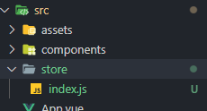
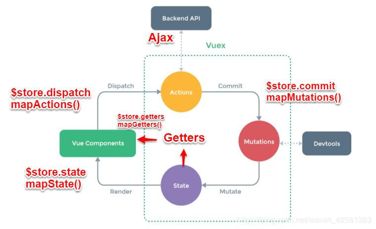

# Vuex

## State Management

### State Management(상태 관리) 개요

✔ **상태(state): 현재에 대한 정보(data)**  
✔ Web Application의 상태: 현재 App이 가지고 있는 data  
✔ 각 component는 독립적이기 때문에 각각의 상태(data를 가진다)  
✔ 하지만 결국 component들이 모여 하나의 App을 구성하므로 여러 개의 component가 같은 상태(data)를 유지해야 한다!

### Pass Props & Emit Event

✔ 데이터의 흐름을 직관적으로 파악 가능하다  
✔ 그러나 **component의 중첩이 깊어지면 데이터의 전달이 어려워진다**는 단점

### Centralized Store

✔ **중앙 저장소(store)**에 데이터를 모아서 상태 관리  
✔ component의 **계층에 상관없이** 중앙 저장소에 접근해서 데이터를 얻거나 변경 가능  
✔ 중앙 저장소의 데이터가 변경되면 각각의 component는 해당 데이터의 변화에 반응하여 새로 변경된 데이터를 반영  
✔ 규모가 크거나 컴포넌트 중첩이 깊은 프로젝트의 관리가 매우 편리

## Vuex 시작하기

### 프로젝트 시작하기

```shell
$ vue create vuex-app

$ cd vuex-app

$ vue add vuex
```



### index.js

```javascript
import Vue from "vue";
import Vuex from "vuex";

Vue.use(Vuex);

export default new Vuex.Store({
  // 기존 vue instance의 data
  state: {},

  // 기존 vue instance의 computed
  getters: {},

  // 기존 vue instance의 methods
  mutations: {},
  actions: {},

  modules: {},
});
```

#### 1. state

✔ vue 인스턴스의 data에 해당  
✔ **중앙에서 관리하는 모든 상태 정보**  
✔ state의 데이터가 변화하면 해당 데이터를 공유하는 component도 자동으로 다시 렌더링  
✔ `$store.state`로 state 데이터에 접근

#### 2. mutations

✔ **실제로 state를 변경하는 유일한 방법**  
✔ Mutations에서 호출되는 핸들러 함수는 반드시 **동기적**이어야함

- 비동기 로직으로 mutations를 사용해서 state를 변경하는 경우, state의 변화를 시기를 특정할 수 없다!

✔ 첫번째 인자로 **state**를 받으며, component 혹은 Actions에서 **`commit()`** 메서드로 호출된다

#### 3. Actions

✔ mutations와 비슷하지만 **비동기** 작업을 포함할 수 있다는 차이가 있음  
✔ **state를 직접 변경하지 않고 commit() 메서드로 mutations를 호출해서 state를 변경**  
✔ `context` 객체를 인자로 받으며, 이 객체를 통해 store.js의 모든 요소와 메서드에 접근할 수 있다 (stated도 직접 변경 가능하지만 변경 하면 안된다!)  
✔ component에서 `dispatch()` 메서드에 의해 호출

#### Mutations & Actions

  
✔ Mutations: state를 변경  
✔ Actions: state 변경을 제외한 나머지 로직

#### 4. Getters

✔ vue 인스턴스의 computed에 해당  
✔ **state를 활용하여 계산된 값을 얻고자 할 때 사용**  
✔ computed와 마찬가지로 getters의 결과는 캐시(cache)되며, 종속된 값이 변경된 경우에만 재계산된다.  
✔ getters에서 계산된 값은 state에 영향 x  
✔ **첫번째 인자로 state, 두번째 인자로 getter**

### 그렇다면 모든 데이터를 Vuex에서 관리할까?

✔ Vuex에서도 여전히 pass props, emit event를 사용하여 상태 관리 할 수 있음  
✔ 개발 환경에 따라 적절하게 사용하는 것이 중요

### 정리

✔ component에서 데이터를 조작하기 위한 데이터의 흐름

- **component => (actions) => mutations => state**

✔ component에서 데이터를 사용하기 위한 데이터의 흐름

- state => (getters) => component

## Vuex 실습

### 객체 축약형 메서드 사용

```javascript
// before
const obj1 = {
  addValue: function (value) {
    return value;
  },
};

// after
const obj2 = {
  addValue(value) {
    return value;
  },
};
```

### state

```javascript
// store/index.js
import Vue from "vue";
import Vuex from "vuex";

Vue.use(Vuex);

export default new Vuex.Store({
  state: {
    message: "message in store",
  },
  getters: {},
  mutations: {},
  actions: {},
  modules: {},
});
```

```vue
// App.vue
<template>
  <div id="app">
    <h1>{{ $store.state.message }}</h1>
  </div>
</template>
```

✔ `$store.state`로 바로 접근 가능! 그러나...

```vue
<template>
  <div id="app">
    <h1>{{ message }}</h1>
  </div>
</template>

<script>
export default {
  name: "App",
  components: {},
  computed: {
    message() {
      return this.$store.state.message;
    },
  },
};
</script>
```

✔ computed에 정의 후 접근하는 것을 권장

### actions

```vue
// App.vue

<template>
  <div id="app">
    <h1>{{ message }}</h1>
    <input type="text" @keyup.enter="changeMessage" v-model="inputData" />
  </div>
</template>

<script>
export default {
  name: "App",
  data() {
    return {
      inputData: null,
    };
  },
  computed: {
    message() {
      return this.$store.state.message;
    },
  },
  methods: {
    changeMessage() {
      const newMessage = this.inputData;
      // action 호출
      this.$store.dispatch("changeMessage", newMessage);
    },
  },
};
</script>
```
✔ state를 변경할 수 있는 mutations 호출  
✔ component에서 `dispatch()`에 의해 호출됨  
✔ dispatch(호출하고자 하는 actions 함수, 넘겨줄 Data)

```javascript
// store/index.js

import Vue from "vue";
import Vuex from "vuex";

Vue.use(Vuex);

export default new Vuex.Store({
  state: {
    message: "message in store",
  },
  getters: {},
  mutations: {},
  actions: {
    changeMessage(context, newMessage) {
      console.log(context);
      console.log(newMessage);
    },
  },
  modules: {},
});
```

✔ actions의 첫 번째 인자는 `context`

- context는 store의 전반적인 속성을 모두 가지고 있으므로 context.state와 context.getters를 통해 mutations를 호출하는 것이 가능
- 단, actions에서 state를 직접 조작 x

✔ actions의 두 번째 인자는 `payload`

- 넘겨준 데이터를 받아서 사용

### mutations
```javascript
// store/index.js

import Vue from 'vue'
import Vuex from 'vuex'

Vue.use(Vuex)

export default new Vuex.Store({
  state: {
    message: 'message in store'
  },
  getters: {
  },
  mutations: {
    // 마지막에 직접적으로 state를 변경하기 때문에명시적으로 구분하기 위해 상수 형태로 이름 작성
    CHANGE_MESSAGE(state, newMessage) {
      // console.log(state)
      // console.log(newMessage)
      
      // state 조작
      state.message = newMessage
    }
  },
  actions: {
    changeMessage(context, newMessage) {
      // console.log(context)
      // console.log(newMessage)

      // mutation 호출
      context.commit('CHANGE_MESSAGE', newMessage)
    }
  },
  modules: {
  }
})
```
✔ actions에서 `commit()`이용해 mutations 호출  
✔ `commit(A, B)`
  - A: 호출하고자 하는 mutations 함수
  - B: payload

### getters
```javascript
// store/index.js

export default new Vuex.Store({
  ...
  getters: {
    messageLength(state) {
      return state.message.length
    }
  },
  ...
})
```
✔ **state를 활용한 새로운 변수**  
✔ 첫번째 인자는 state,두번째 인자는 getters(선택)

```vue
// App.vue

<template>
  <div id="app">
    <h1>{{ message }}</h1>
    <h2>문자의 길이는 {{ messageLength }}</h2>
    <input type="text" @keyup.enter="changeMessage" v-model="inputData" />
  </div>
</template>

<script>
export default {
  ...
  computed: {
    message() {
      return this.$store.state.message;
    },
    // getters 불러오기
    messageLength() {
      return this.$store.getters.messageLength
    }
  },
  ...
};
</script>
```