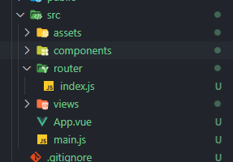
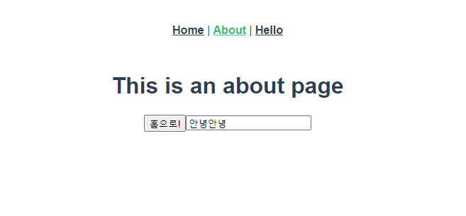
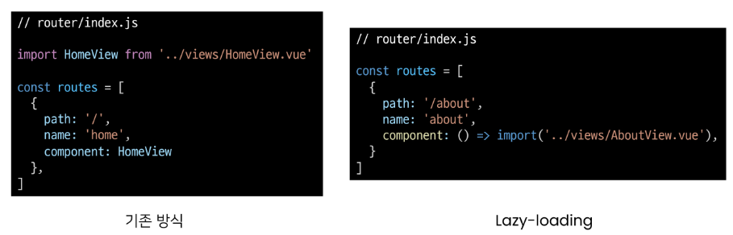

# Vue Router

## Routing

### Routing

✔ 네트워크에서 경로를 선택하는 프로레스  
✔ 웹 서비스에서의 라우팅: **유저가 방문한 URL에 대한 적절한 결과를 응답하는 것**

### Routing in SSR

✔ Server가 모든 라우팅을 통제  
✔ URL로 요청이 들어오면 응답으로 완성된 HTML 제공

- Django로 보낸 요청의 응답 HTML은 완성본인 상태

✔ 결론적으로, Routing(URL)에 대한 결정권은 서버가 가진다.

### Routing in SPA / CSR

✔ 서버는 하나의 HTML(index.html)만을 제공  
✔ 이후에 모든 동작은 하나의 HTML 문서 위에서 JavaScript 코드 활용

- DOM을 그리는데 필요한 추가적인 데이터가 있다면 axios와 같은 AJAX 요청을 보낼 수 있는 도구를 사용하여 데이터를 가져오고 처리

✔ **즉 하나의 URL만 가진다.**

### Why routing?

✔ 동작에 따라 URL이 꼭 바뀔 필요는 없으나 **유저의 사용성 관점에서는 필요하다**

✔ Routing이 없다면

- 유저가 URL을 통한 페이지의 변화 감지 불가
- 페이저가 무엇을 렌더링 중인지에 대한 상태를 알 수 없다.
- **뒤로 가기 기능 사용 불가**

## Vue Router

### Vue Router

✔ Vue의 공식 라우터  
✔ SPA 상에서 라우팅을 쉽게 개발할 수 있는 기능 제공  
✔ 라우트(routes)에 컴포넌트를 매핑한 후, 어떤 URL에서 렌더링 할지 알려준다  
✔ SPA를 MPA처럼 URL을 이동하면서 사용 가능

### Vue Router 시작하기

```shell
$ vue create vue-router-app

$ cd vue-router-app

$ vue add router
```


✔ History Mode: Y

#### History mode

✔ 브라우저의 History API를 활용한 방식  
- 새로 고침 없이 URL 이동 기록을 남길 수 있다.

✔ 우리에게 익숙한 URL 구조로 사용 가능  
- ex) `http://localhost:8080/index`
  
<br>
<br>
<br>

  
✔ router/index.js 생성  
✔ views 폴더 생성

### router-link
✔ a태그와 비슷한 기능 -> URL 이동  
- routes에 등록된 컴포넌트와 매핑  
- 히스토리에 모드에서 router-link는 클릭 이벤트를 차단하여 a태그와 달리 브라우저가 페이지를 다시 로드하지 않도록 한다  

✔ 목표 경로는 `'to'`속성으로 지정  

### router-view
✔ 주어진 URL에 대해 일치하는 컴포넌트를 렌더링하는 컴포넌트  
✔ 실제 component가 DOM에 부착되어 보이는 자리 의미  
✔ router-link를 클릭하면 routes에 매핑된 컴포넌트 렌더링  

✔ Django에서의 block tag와 유사  
- App.vue는 base.html 역할
- router-view는 block 태그로 감싼 부분

### src/router/index.js

```javascript
// src/router/index.js

import Vue from 'vue'
import VueRouter from 'vue-router'
import HomeView from '../views/HomeView.vue'

Vue.use(VueRouter)

const routes = [
  {
    path: '/',
    name: 'home',
    component: HomeView
  },
  {
    path: '/about',
    name: 'about',
    // route level code-splitting
    // this generates a separate chunk (about.[hash].js) for this route
    // which is lazy-loaded when the route is visited.
    component: () => import(/* webpackChunkName: "about" */ '../views/AboutView.vue')
  }
]

const router = new VueRouter({
  mode: 'history',
  base: process.env.BASE_URL,
  routes
})

export default router
```

✔ 라우터에 관련된 정보 및 설정이 작성되는 곳  
✔ Django의 urls.py에 해당  
✔ routes에 URL와 컴포넌트 매핑  

### src/Views
✔ router-view에 들어갈 component 작성  
✔ 기존에 컴포넌트를 작성하던 곳은 componet 폴더뿐이었지만 이제 두 폴더로 나뉘어진다  
✔ 각 폴더 안의 .vue 파일들이 기능적으로 다른 것은 아니다  

#### 폴더별 컴포넌트 배치(규약은 아니다)
✔ `views/`
- routes에 매핑되는 컴포넌트, 즉 <router-view>의 위치에 렌더링 되는 컴포넌트를 모아두는 폴더  
- 다른 컴포넌트와 구분하기 위해 View로 끝나도록 만드는 것 권장 

✔ `components/`
- routes에 매핑된 컴포넌트의 하위 컴포넌트를 모아두는 폴더
- HomeView 컴포넌트 내부의 HelloWorld 컴포넌트

## Vue Router 실습

### 주소 이동 2가지 방법
1. 선언적 방식 네비게이션
2. 프로그래밍 방식 네비게이션

### 1. 선언적 방식 네비게이션
```vue
// App.vue

<template>
  <div id="app">
    <nav>
      <router-link :to="{ name: 'home'}">Home</router-link> |
      <router-link :to="{ name: 'about' }">About</router-link>
    </nav>
    <router-view/>
  </div>
</template>
```

✔ router-link의 `'to'`속성으로 주소 전달  
✔ 동적인 값을 사용하기 때문에 v-bind 사용  

### 프로그래밍 방식 네비게이션
```vue
<template>
  <div class="about">
    <h1>This is an about page</h1>
    <button @click="toHome">홈으로!</button>
  </div>
</template>

<script>
export default {
  name: 'AboutView',
  methods: {
    toHome() {
      this.$router.push({name: 'home'})
    }
  },
}
</script>
```

✔ Vue 인스턴스 내부에서 라우터 인스턴스에서 `$router`로 접근 가능  
✔ 다른 URL로 이동하겨면 `this.$router.push` 사용
- history stack에 이동할 URL을 넣는 방식  
- history stack에 기록이 남기 때문에 사용자가 브라우저의 뒤로 가기 버튼을 클릭하면 이전 URL로 이동 가능  

✔ `<router-link :to='...'>`를 클릭하는 것과 `$router.push(...)`를 호출하는 것과 같은 동작

### Dynamic Route Matching

```javascript
// router/index.js

import HelloView from '@/views/HelloView'

Vue.use(VueRouter)

const routes = [
  ...
  {
    path: '/hello/:username',
    name: 'hello',
    component: HelloView
  }
]
```
```vue
// views/HelloView.vue

<template>
  <div></div>
</template>

<script>
export default {
  name: 'HelloView'
}
</script>

<style>

</style>
```


✔ `$route.params`로 변수에 접근 가능

```vue
// views/HelloView.vue

<template>
  <div>
    <h1>hello, {{ $route.params.userName }}</h1>
  </div>
</template>

<script>
export default {
  name: 'HelloView'
}
</script>

<style>

</style>
```

✔ 단, HTML에서 직접 사용하기보다는 data에 넣어서 사용하는 것 권장
```vue
<template>
  <div>
    <h1>hello, {{ userName }}</h1>
  </div>
</template>

<script>
export default {
  name: 'HelloView',
  data() {
    return {
      userName: this.$route.params.userName
    }
  },
}
</script>

<style>

</style>
```

#### Dynamic Route Matching - 선언적 방식 네비게이션
```vue
// App.vue

<template>
  <div id="app">
    <nav>
      <router-link :to="{ name: 'home'}">Home</router-link> |
      <router-link :to="{ name: 'about' }">About</router-link> |
      <router-link :to="{ name: 'hello', params: { userName: 'sunjun' }}">Hello</router-link>
    </nav>
    <router-view/>
  </div>
</template>
```
✔ App.vue에서 sunjun으로 인사하는 페이지로 이동  
✔ params 이용하여 동적 인자 전달 가능  

#### Dynamic Route Matching - 프로그래밍 방식 네비게이션
```vue
// AboutView.vue

<template>
  <div class="about">
    <h1>This is an about page</h1>
    <button @click="toHome">홈으로!</button>
    <input 
      type="text"
      @keyup.enter="goToHello"
      v-model='inputData'
      >
  </div>
</template>

<script>
export default {
  name: 'AboutView',
  data() {
    return {
      inputData : null
    }
  },
  methods: {
    toHome() {
      this.$router.push({name: 'home'})
    },
    goToHello() {
      this.$router.push({ name: 'hello', params: { userName: this.inputData }})
    }
  },
}
</script>

```




### route에 컴포넌트를 등록하는 또다른 방법



✔ router/index.js에 컴포넌트를 등록하는 또다른 방식

### lazy-loading (지연 로딩)

✔ 모든 파일을 한 번에 로드하려고 하면 모든 걸 다 읽는 시간이 매우 오래 걸린다  
✔ 미리 로드하지 않고 특정 라우트에 방문할 때 매핑된 컴포넌트의 코드를 로드하는 방식을 활용할 수 있음  
- 당장 사용하지 않을 컴포넌트는 먼저 로드하지 않는다