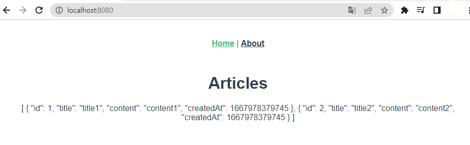
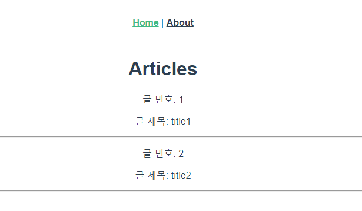

# Articles with Vue

## 사전 준비

```shell
$ vue create articles
$ cd articles
$ vue add vuex
$ vue add router
```

```vue
// App.vue

<template>
  <div id="app">
    <router-view/>
  </div>
</template>
```

## Index

1. state 정의

```javascript
// store/index.js

import Vue from 'vue'
import Vuex from 'vuex'

Vue.use(Vuex)

export default new Vuex.Store({
  state: {
    article_id: 3,
    articles: [
      {
        id: 1,
        title: 'title1',
        content: 'content1',
        createdAt: new Date().getTime()
      },
      {
        id: 2,
        title: 'title2',
        content: 'content2',
        createdAt: new Date().getTime()
      },
    ]
  },
})
```

2. IndexView 컴포넌트 및 라우터 작성

```vue
// views/IndexView.vue

<template>
  <div>
    <h1>Articles</h1>
  </div>
</template>

<script>
export default {
  name: 'IndexView'
}
</script>

<style>

</style>
```

```javascript
// router/index.js

import IndexView from '../views/IndexView.vue'

Vue.use(VueRouter)

const routes = [
  {
    path: '/',
    name: 'IndexView',
    component: IndexView
  },
]  
```

3. state 에서 불러온 articles 출력

```vue
// views/IndexView.vue

<template>
  <div>
    <h1>Articles</h1>
    {{ articles }}
  </div>
</template>

<script>
export default {
  name: 'IndexView',
  computed: {
    articles() {
      return this.$store.state.articles
    }
  },
}
</script>
```



4. ArticleItem 컴포넌트 작성

```vue
// components/ArticleItem.vue

<template>
  <div>
  </div>
</template>

<script>
export default {
  name: 'ArticleItem',
}
</script>
```

5. IndexView 컴포넌트에서 ArticleItem 컴포넌트 등록 밑 props 데이터 전달
   
```vue
// views/IndexView.vue

<template>
  <div>
    <h1>Articles</h1>
    <ArticleItem 
      v-for="article in articles"
      :key="article.id"
      :article=article
    />
  </div>
</template>

<script>
import ArticleItem from '../components/ArticleItem.vue'

export default {
  name: 'IndexView',
  components: {
    ArticleItem
  },
  computed: {
    articles() {
      return this.$store.state.articles
    }
  },
}
</script>
```

6. props 데이터 선언 및 게시글 출력

```vue
// components/ArticleItem.vue

<template>
  <div>
    <p>글 번호: {{ article.id }}</p>
    <p>글 제목: {{ article.title }}</p>
    <hr>
  </div>
</template>

<script>
export default {
  name: 'ArticleItem',
  props: {
    article: Object
  }
}
</script>
```

7. 결과 확인
   

## Create

1. CreateView 컴포넌트 및 라우터 작성

```vue
// views/CreateView.vue

<template>
  <div>
    <h1>게시글 작성</h1>
  </div>
</template>

<script>
export default {
  name: "CreateView"
}
</script>
```

```javascript
// router/index.js

const routes = [
  ...
  {
    path: '/create',
    name: 'create',
    component: CreateView
  },
]
```

2. Form 생성 및 데이터 정의
```vue
<template>
  <div>
    <h1>게시글 작성</h1>
    <form>
      <label for="title">제목: </label>
      <input id="title" type="text" v-model="title"> 
      <br>
      <label for="content">내용: </label>
      <textarea
        id="content" cols="30" rows="10"
        v-model="content"
      ></textarea>
      <input type="submit">
    </form>
  </div>
</template>

<script>
export default {
  name: "CreateView",
  data() {
    return {
      title: null,
      content: null,
    }
  },
}
</script>

```

3. submit 이벤트 동작 취소하기

```vue
// views/CreateView.vue

<template>
  <div>
    <h1>게시글 작성</h1>
    <form @submit.prevent="createArticle">
    ...
    </form>
  </div>
</template>
```

✔ `v-on: {event}.prevent` 활용하여 submit 이벤트 동작 취소  

4. actions에 여러 데이터를 넘길 때 하나의 object로 만들어서 전달
```vue
// views/CreateView.vue

<script>
export default {
  name: "CreateView",
  data() {
    return {
      title: null,
      content: null,
    }
  },
  methods: {
    createArticle() {
      const title = this.title
      const content = this.content
      const payload = {
        title, content
      }
      this.$store.dispatch('createArticle', payload)
    }
  }
}
</script>
```

5. actions에서 넘어온 데이터를 활용하여 article 생성 후 mutations 호출
  
```javascript
// store/index.js

actions: {
    createArticle(context, payload) {
      const article = {
        id: context.state.article_id,
        title: payload.title,
        content: payload.content,
        createdAt: new Date().getTime()
      }
      context.commit('CREATE_ARTICLE', article)
    }
  },
```

6. mutations에서는 전달된 article 객체를 사용해 게시글 작성

```javascript
  mutations: {
    CREATE_ARTICLE(state, article) {
      state.articles.push(article)
      state.article_id = state.article_id + 1
    }
  },
```

7. 뒤로가기 링크 추가

```vue
// views/CreateView.vue

<template>
  <div>
    <h1>게시글 작성</h1>
    ...
    <router-link :to="{ name: 'index' }">뒤로가기</router-link>
  </div>
</template>
```

8. 게시글 생성 후 index 페이지로 이동하도록 하는 네비게이터 작성

```vue
// views/CreateView.vue

  methods: {
    createArticle() {
      ...
      this.$store.dispatch('createArticle', payload)
      this.$router.push({ name: 'index' })
    }
  }
```

9. IndexView 컴포넌트에 게시글 작성 페이지로 이동하는 링크 추가

```vue
// views/IndexView.vue

<template>
  <div>
    <h1>Articles</h1>
    <router-link :to="{name:'create'}">게시글 작성</router-link>
    <ArticleItem 
      v-for="article in articles"
      :key="article.id"
      :article=article
    />
  </div>
</template>
```

## Delete

