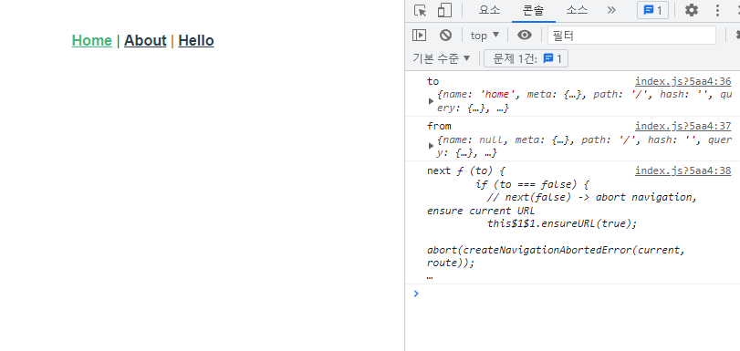
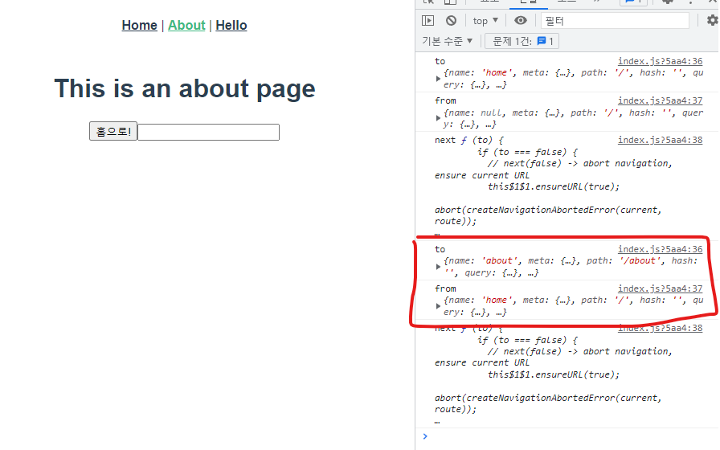
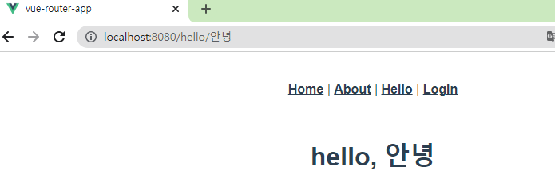
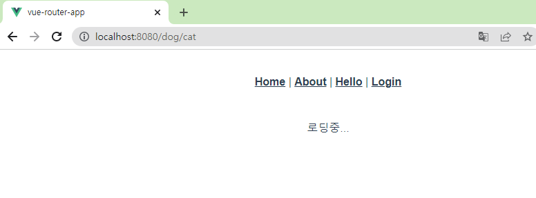

# Navigation Guard

## 네비게이션 가드

✔ Vue router를 통해 특정 URL에 접근할 때 다른 url로 redirect 하거나 해당 URL로의 접근을 막는 방법

### 네비게이션 가드의 종류

✔ **전역 가드**: 애플리케이션 전역에서 동작  
✔ **라우터 가드**: 특정 url에서만 동작  
✔ **컴포넌트 가드**: 라우터 컴포넌트 안에 정의

## 전역 가드

### Global Before Guard

✔ 다른 url 주소로 이동할 때 항상 실행  
✔ `router/index.js`에 `router.beforeEach()`를 사용하여 설정  
✔ 콜백 함수의 값으로 다음 3개의 인자를 받는다

1. to: 이동할 url 정보가 담긴 Route 객체
2. from: 현재 url 정보가 담긴 route 객체
3. next: 지정한 url로 이동하기 위해 호출하는 함수
   - 콜백 함수 내부에서 반드시 한 번만 호출
   - 기본적으로 to에 해당하는 url로 이동

✔ URL이 변경되어 화면이 전환되기 전 `router.beforeEach()` 호출
- 화면이 전환되지 않고 대기 상태가 된다

✔ 변경된 URL로 라우팅되기 위해서는 next() 호출 필요  
- next() 호출되기 전까지 화면이 전환되지 않는다.

### Global Before Guard

```javascript
// router/index.js

...

const router = new VueRouter({
  mode: 'history',
  base: process.env.BASE_URL,
  routes
})

router.beforeEach((to, from, next) => {
  console.log('to', to)
  console.log('from', from)
  console.log('next', next)
})
```



✔ `/home/`으로 이동하더라도 라우팅이 되지 않고 위와 같이 로그만 출력된다.  
✔ `next()`가 호출되지 않으면 화면이 전환되지 않는다.  

```javascript
// router/index.js

...

const router = new VueRouter({
  mode: 'history',
  base: process.env.BASE_URL,
  routes
})

router.beforeEach((to, from, next) => {
  console.log('to', to)
  console.log('from', from)
  console.log('next', next)
  next()
})

export default router
```



✔ to에는 이동할 url인 about에 대한 정보  
✔ from에는 현재 url인 home에 대한 정보  

### Login 여부에 따른 라우팅 처리  

1. Login이 되어 있지 않다면 Login 페이지로 이동하는 기능 추가

```vue
// views/LoginView.vue


<template>
  <div>
    <h1>로그인 페이지</h1>
  </div>
</template>

<script>
export default {
  name: 'LoginView'
}
</script>

<style>

</style>
```

```javascript
// router/index.js

import LoginView from '@/views/LoginView'

Vue.use(VueRouter)

const routes = [
  {
    path: '/login',
    name: 'login',
    component: LoginView
  }
]
```

2. LoginView에 대한 라우터 링크 추가

```vue
// App.vue

<template>
  <div id="app">
    <nav>
      ...
      <router-link :to="{ name: 'login' }">Login</router-link>
    </nav>
```

3. Login 여부에 따른 라우팅 처리

```javascript
// router/index.js

router.beforeEach((to, from, next) => {
  // 로그인 여부(임시로)
  const isLoggedIn = true

  // 로그인이 필요한 페이지
  const authPages = ['hello']

  // 아픙로 이동할 페이지(to)가 로그인이 필요한 사이트인지 확인
  const isAuthRequired = authPages.includes(to.name)

  if (isAuthRequired && !isLoggedIn) {
    next({ name: 'login' })
  } else {
    next()
  }
})
```

✔ isAuthRequired 값에 따라 로그인이 필요한 페이지이고 로그인이 안되어 있으면 Login 페이지로 이동

4. view가 여러 개라면

```javascript
// router/index.js

router.beforeEach((to, from, next) => {
  // 로그인 여부(임시로)
  const isLoggedIn = true

  const allowAllPages = ['login']

  // 아픙로 이동할 페이지(to)가 로그인이 필요한 사이트인지 확인
  const isAuthRequired = !allowAllPages.includes(to.name)

  if (isAuthRequired && !isLoggedIn) {
    next({ name: 'login' })
  } else {
    next()
  }
})
```

✔ Login 하지 않아도 되는 페이지를 모아둘 수 있다.

## 라우터 가드

### 개요
✔ 전체 route가 아닌 특정 route에 대해서만 가드 설정  
✔ `beforEnter()`
- route에 진입했을 대 실행
- 라우터를 등록한 위치에 추가
- 단 매개변수, 쿼리, 해시 값이 변경될 때는 실행되지 않고 다른 경로에서 탐색할 때만 실행  
- 콜백 함수는 to, from, next를 인자로 받는다.

### Login 여부에 따른 라우팅 처리

✔ 이미 로그인 되어 있는 경우에 HomeView로 이동하기  

```javascript
// router/index.js

const isLoggedIn = true

const routes = [
  {
    path: '/login',
    name: 'login',
    component: LoginView,
    beforeEnter: (to, from, next) => {
      if (isLoggedIn === true) {
        console.log('이미 로그인')
        next({ name: 'home' })
      } else {
        next()
      }
    }
  }
]
```
✔ 로그인 여부에 대한 임시 변수 생성  
✔ 로그인이 되어 있는 경우 home으로 이동  
✔ 로그인이 되어 있지 않은 경우 login으로 이동

## 컴포넌트 가드 

### 개요
✔ 특정 컴포넌트 내에서 가드를 지정하고 싶을 때 사용  
✔ `beforeRouteUpdate()`: 해당 컴포넌트를 연결하는 경로가 변경될 때

### Params 변화 감지  



✔ navbar에 있는 Hello를 누르면 sunjun에게 인사하는 페이지로 이동하면 URL은 변하지만 페이지는 변화하지 않는다.  
✔ 변화하지 않는 이유
- 컴포넌트가 재사용 되었기 때문에 **lifecycle hook이 호출되지 않고, 따라서 `$route.params`에 있는 데이터를 새로 가져오지 않는다.**

```vue
<script>
export default {
  name: 'HelloView',
  data() {
    return {
      userName: this.$route.params.userName
    }
  },
  beforeRouteUpdate(to, from, next) {
    this.userName = to.params.userName
    next()
  }
}
</script>
```
✔ userName을 이동할 params에 있는 userName으로 재할당

## 404 Not Found

### 404 Not Found

```vue
// views/NotFound404

<template>
  <div>
    <h1>404 Not Found</h1>
  </div>
</template>

<script>
export default {
  name: 'NotFound404'
}
</script>
```

```javascript
// router/index.js

import NotFound404 from '@/views/NotFound404'

Vue.use(VueRouter)

const routes = [
  ...
  {
    path: '/404',
    name: 'NotFound404',
    component: NotFound404
  },
]
```

### 요청한 리소스가 존재하지 않는 경우

```javascript
// router/index.js

const routes = [
  ...
  {
    path: '*',
    redirect: '/404
  },
]
```

✔ 모든 경로에 대해 404page로 redirect 시키기
- 기존에 명시한 경로가 아닌 모든 경로가 404page로 redirect
- **routes 최하단부에 작성해야 한다**

### 형식은 유효하지만 특정 리소스를 찾을 수 없는 경우

✔ 강아지 사진 출력 페이지

```javascript
<template>
  <div>
    
  </div>
</template>

<script>
import axios from 'axios'

export default {
  name: 'DogView',
  data() {
    return {
      imgSrc: null,
    }
  },
  methods: {
    getDogImage() {
      const breed = this.$route.params.breed
      const dogImageUrl = `https://dog.ceo/api/breed/${breed}/images/random`
      axios({
        method: 'get',
        url: dogImageUrl
      })
        .then((response) => {
          const imgSrc = response.data.message
          this.imgSrc = imgSrc
        })
        .catch((error) => {
          console.log(error)
        })
    }
  },
  created() {
    this.getDogImage()
  }
}
</script>

<style>

</style>
```

```javascript
// views/DogView.vue

const routes = [
  ...
  {
    path: '/dog/:breed',
    name: 'dog',
    component: DogView
  },
]
```

✔ Dog api axios 로직 작성

```vue
// views/DogView.vue


<template>
  <div>
    <p v-if="!imgSrc">{{ message }}</p>
    
  </div>
</template>

<script>
import axios from 'axios'

export default {
  name: 'DogView',
  data() {
    return {
      imgSrc: null,
      message: '로딩중...'
    }
  },
  ...
}
```



```vue
// views/DogView.vue

axios({
        method: 'get',
        url: dogImageUrl
      })
        .then((response) => {
          const imgSrc = response.data.message
          this.imgSrc = imgSrc
        })
        .catch((error) => {
          this.message=`${this.$route.params.breed}는 없는 품종입니다.`
          console.log(error)
        })
```

✔ 요청 실패시 error에서 메시지 출력하기

### 404 Not Found로 이동 시키기

```vue
// views/DogView.vue

axios({
        method: 'get',
        url: dogImageUrl
      })
        .then((response) => {
          const imgSrc = response.data.message
          this.imgSrc = imgSrc
        })
        .catch((error) => {
          this.$router.push('/404')
          console.log(error)
        })
```