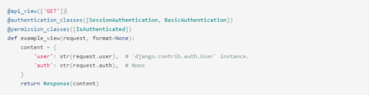

# DFR Auth System

## Authentication &  Authorization

### Authentication - 인증, 입증

✔ 자신이라고 주장하는 사용자가 누구인지 확인하는 행위  
✔ 모든 보안 프로세스의 첫 번째 단계   
✔ 즉, 내가 누구인지 확인하는 과정  
✔ 401 Unauthorized  

### Authorizaion - 권한 부여, 허가  
✔ 사용자에게 특정 리소스 또는 기능에 대한 엑세스 권한을 부여하는 과정(절차)  
✔ 보안 환경에서 구너한 부여는 항상 인증이 먼저 필요함  
- 사용자는 조직에 대한 엑세스 권한을 부여 받기 전에 먼저 자신의 ID가 진짜인지 먼저 확인해야 한다.  

✔ 서류의 등급, 웹 페이지에서 글을 조회/삭제/수정 할 수 있는 방법, 제한구역(admin) 등등
- 인증이 되었어도 모든 권한을 부여 받는 것은 아니다  

✔ **403 Forbidden**  
- **401과 다른 점은 서버는 클라이언트가 누구인지 알고 있음**

## How to determine authentication

### 인증 여부 확인 방법  


✔ settings.py에 기본적인 인증 절차를 어떠한 방식으로 둘 것인지 설정(글로벌)   
✔ 우리가 사용할 방법은 **`ToeknAuthentication`**

<br>



✔ 개별 view함수마다 decorator를 활용해 다른 인증 방식을 적용할 수 있다.  

### 다양한 인증 방식

✔ BasicAuthentication
- 가장 기본적인 수준의 인증방식
- 테스트에 적합

✔ SessionAuthentication
- Django에 사용하였던 session 기반의 인증 시스템  
- DRF와 Djano session 인증 방식은 보안적 측면을 구성하는 방법에 차이가 있다.  

✔ RemoteUserAuthentication
- Django의 Remote user 방식을 사용할 때 활용하는 인증 방식

✔ **ToeknAuthentication**
- 간단한 구현
- 기본적인 보안 기능 제공
- 다양한 외부 패키지 

✔ **settings.py에서 `DEFAULT_AUTHENTICATION_CLASSES`를 정의해야 한다!!**
- `TokenAuthentication` 인증 방식을 사용할 것임을 명시  

### ToeknAuthentication 사용 방법

1. INSTALLED_APPS에 `rest_framework.authtoken` 등록
   
```python
INSTALLED_APPS = [
    ...
    # Auth
    'rest_framework.authtoken',
]
```
✔ 등록하고 migrate 해주기

2. 각 user마다 고유 Token 생성

3. 생성한 Toekn을 각 User에게 발급  

4. User는 발급 받은 Token을 headers에 담아 요청과 함께 전송
- 단 반드시 `Token` 문자열 함께 삽입  
- **Token 문자열과 발급받은 실제 token 사이를 ' '(공백)으로 구분**


### 토큰 생성 및 관리 문제점
1. Token 생성 시점
2. 생성한 Token 관리 방법
3. User와 관련된 각종 기능 관리 방법

## dj-rest-auth

### 개요
✔ 회운가입, 인증(소셜미디어 인증 포함), 비밀번호 재설정, 사용자 세부 검색, 회원정보 수정 등을 위한 REST API end point 제공  
✔ **django-rest-auth**는 더 이상 지원x!!  
✔ **dj-rest-auth 사용!!**


### 시작히기 전에
✔ 시작하기 전, `auth.User`를 `accounts.User`로 변경  
✔ `auth.User`로 설정된 DB 제거  
✔ `my_api/settings.py` 설정  

### dj-rest-auth 적용하기


✔ 다시 migration 해주기!  


✔ 회원 가입 기능은 없다!!  

### Registration


✔ Registration 기능을 사용하기 위해 추가 기능 등록 및 설치 필요  


✔ signup 페이지 확인  


### Sign up & Login


✔ 회원 가입 요청 후 결과 확인
- 요청에 대한 응답으로 Token 발급  

✔ 로그인 시에도 동일한 토큰 발급  

### Password Change

✔ `/accounts/password/change/` 기능 확인
- 로그인 되어 있거나, 인증이 필요한 기능
- DRF 자체 제공 HTML form 에서는 토큰을 입력할 수 있는 공간이 없다.  

1. Postman으로 POST 요청


✔ body/form-data에 값 입력

2. headers에 Token 입력


✔ Authorization: Token { your token } 형식에 맞춰 입력 (띄어쓰기 주의!)

3. 인증 방법 입증

```python
# settings.py

REST_FRAMEWORK = {
    # Authentication
    'DEFAULT_AUTHENTICATION_CLASSES': [
        'rest_framework.authentication.TokenAuthentication',
    ],
}
```

✔ settings.py에  token 기반 인증 방식 사용 선언  

4. 최종 결과 확인


## Permission Setting

[drf: permissions 공식 문서](https://www.django-rest-framework.org/api-guide/permissions/)

✔ 권한 세부 설정
1. 모든 요청에 대한 인증을 요구하는 설정
2. 모든 요청에 대해 인증이 없어도 허용하는 설정  

✔ 설정 위치: 인증 방법을 설정한 곳과 동일

```python
# my_api/settings.py

REST_FRAMEWORK = {
    # permission
    'DEFAULT_PERMISSION_CLASSES': [
        # 'rest_framework.permissions.IsAuthenticated',
        'rest_framework.permissions.AllowAny',
    ],
}
```
✔ 모든 요청에 대해 허용 설정  

### Article List Read

1. `articles/views.py`

```python
# articles/views.py

# permission Decorators
from rest_framework.decorators import permission_classes
from rest_framework.permissions import IsAuthenticated


@api_view(['GET', 'POST'])
@permission_classes([IsAuthenticated])
def article_list(request):
    if request.method == 'GET':
        # articles = Article.objects.all()
        articles = get_list_or_404(Article)
        serializer = ArticleListSerializer(articles, many=True)
        return Response(serializer.data)

    elif request.method == 'POST':
        serializer = ArticleSerializer(data=request.data)
        if serializer.is_valid(raise_exception=True):
            serializer.save()
            # serializer.save(user=request.user)
            return Response(serializer.data, status=status.HTTP_201_CREATED)
```

✔ 게시글 조회 및 생성 요청 시 인증된 경우만 허용하도록 권한 부여 -> decorator 활용  

2. 조회 요청 확인


✔ 게시글 조회 시 로그인 필요

### Article Create

1. Postman으로 생성 요청 확인


✔ 인증된 사용자임을 나타내는 token을 추가 해준다.  

2. 결과 확인


