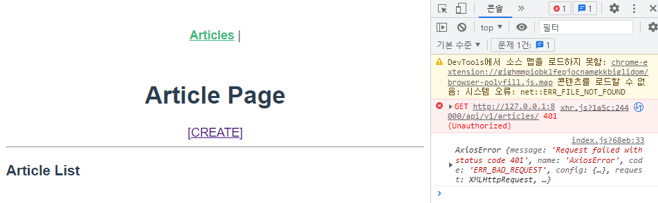
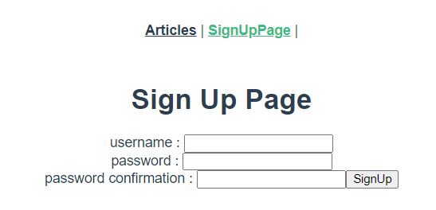
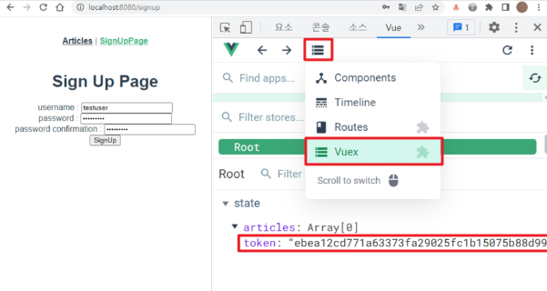
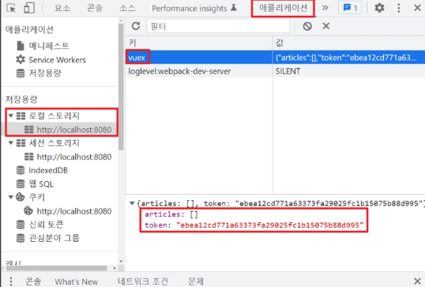
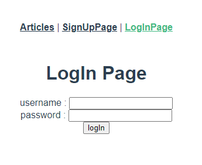
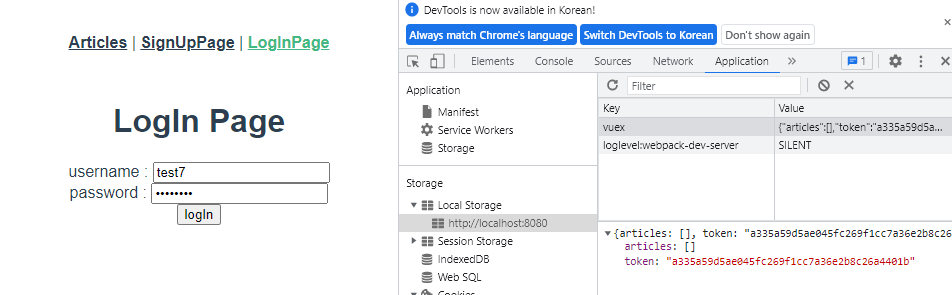
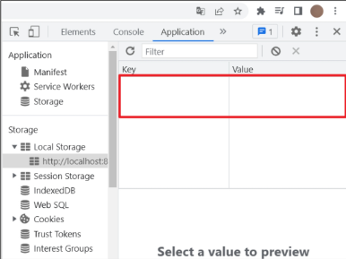
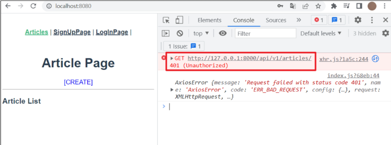
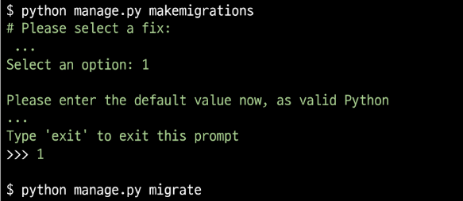

# DRF Auth with Vue

### vue server 요청 정상 작동 여부 확인



✔ 401 status code  
✔ 인증되지 않은 사용자이므로 조회 요청이 불가능!  

## SignUp Request

### SignUp Page

1. `views/SignUpView.vue`

```vue
// views/SignUpView.vue

<template>
  <div>
    <h1>Sign Up Page</h1>
    <form @submit.prevent="signUp">
      <label for="username">username : </label>
      <input type="text" id="username" v-model="username"><br>

      <label for="password1"> password : </label>
      <input type="password" id="password1" v-model="password1"><br>

      <label for="password2"> password confirmation : </label>
      <input type="password" id="password2" v-model="password2">
      
      <input type="submit" value="SignUp">
    </form>
  </div>
</template>

<script>
export default {
  name: 'SignUpView',
  data() {
    return{
      username: null,
      password1: null,
      password2: null,
    }
  },
  methods: {
  }
}
</script>
```

✔ Server에서 정의한 field명 확인
1. username
2. password1
3. password2

2. `router/index.js`

```javascript
// router/index.js

import SignUpView from '@/views/SignUpView'

Vue.use(VueRouter)

const routes = [
  ...
  {
    path: '/signup',
    name: 'SignUpView',
    component: SignUpView
  },
  ...
]
```

3. `src/App.vue`

```vue
// src/App.vue

<template>
  <div id="app">
    <nav>
      <router-link :to="{ name: 'ArticleView' }">Articles</router-link> | 
      <router-link :to="{ name: 'SignUpView' }">SignUpPage</router-link> | 
    </nav>
    <router-view/>
  </div>
</template>
```

4. 결과 확인



### SignUp Request

✔ 회원가입을 완료 시 응답 받을 정보 Token을 store에서 관리할 수 있도록 actions를 활용하여 요처 후, state에 저장할 로직 작성
- 회원가입이나 로그인 후 얻을 수 있는 Toekn을 server의 구성방식에 따라 매 요청마다 요구할 수 있으므로, 다양한 컴포넌트에 쉽게 접근할 수 있도록 중앙 상태 저장소인 vuex에서 관리

1. `vies/SignUpView.vue`

```vue
// views/SignUpView.vue

<script>
export default {
  ...
  methods: {
    signUp() {
      const username = this.username
      const password1 = this.password1
      const password2 = this.password2

      const payload = {
        username: username,
        password1: password1,
        password2: password2,
      }

      this.$store.dispatch('signUp', payload)
    }
  }
}
</script>
```

✔ 사용자 입력 값을 하나의 객체 payload에 담아 전달  

2. `store/index.js`

```javascript
// store/index.js

actions: {
    signUp(context, payload) {
      axios({
        method: 'post',
        url: `${API_URL}/accounts/signup/`,
        data: {
          // 축약형 표현
          // username,
          // password1,
          // password2,
          username: payload.username,
          password1: payload.password1,
          password2: payload.password2,
        }
      })
        .then((res) => {
          console.log(res)
          context.commit('SIGN_UP', res.data.key)
        })
        .catch((err) => {
          console.log(err)
        })
    }
  },
```

✔ payload가 가진 값 각각 할당  
✔ AJAX 요청으로 응답 받은 데이터는 다수의 컴포넌트에서 사용  
✔ state에 저장

3. `store/index.js`

```javascript
// store/index.js

export default new Vuex.Store({
  state: {
    articles: [],
    toekn: null,
  },
  getters: {
  },
  mutations: {
    GET_ARTICLES(state, articles) {
      state.articles=articles
    },
    SIGN_UP(state, token){
      state.token = token
    }
  },
  ...
})
```

✔ token을 저장할 위치 확인  
✔ mutations을 통해 state 변화  

4. 요청 결과 확인



## 토큰 관리

✔ 게시물 전체 조회와 달리, 인증 요청의 응답으로 받은 Token을 매번 요청하기 힘들다.  
✔ localStorage에 Token 저장을 위해 `vuex-persistedstate` 활용

1. 설치

```shell
$ npm install vuex-persistedstate
```

2. `store/index.js`

```javascript
// store/index.js

import createPersistedState from 'vuex-persistedstate'


export default new Vuex.Store({
  plugins: [
    createPersistedState(),
  ],
  ...
})
```

3. 결과 확인



### [참고] User 인증 정보를 localStorage에 저장해도 되는가?

✔ 보안의 관점에서 안전한 방법은 아니다.  
✔ 따라서 vuex-persistedstate는 아래 2가지 방법을 제공한다.  
1. 쿠키 사용하여 관리
2. 로컬 저장소를 난독화 하여 관리

## Login Request

### Login Page

1. `views./LogInView.vue`

```vue
// views/LogInView.vue

<template>
  <div>
    <h1>LogIn Page</h1>
    <form @submit.prevent="logIn">
      <label for="username">username : </label>
      <input type="text" id="username" v-model="username"><br>

      <label for="password"> password : </label>
      <input type="password" id="password" v-model="password"><br>

      <input type="submit" value="logIn">
    </form>
  </div>
</template>

<script>
export default {
  name: 'LogInView',
  data() {
    return{
      username: null,
      password: null
    }
  },
  methods: {
  }
}
</script>
```

2. `router/index.js`

```javascript
// router/index.js

...
import LogInView from '@/views/LogInView'


Vue.use(VueRouter)

const routes = [
  ...
  {
    path: '/login',
    name: 'LogInView',
    component: LogInView
  },
  ...
]


```

3. `src/App.vue`

```vue
// src/App.vue

<template>
  <div id="app">
    <nav>
      <router-link :to="{ name: 'ArticleView' }">Articles</router-link> | 
      <router-link :to="{ name: 'SignUpView' }">SignUpPage</router-link> | 
      <router-link :to="{ name: 'LogInView' }">LogInPage</router-link>
    </nav>
    <router-view/>
  </div>
</template>
```

4. 결과 확인



### Login Request

✔ signUp과 로직은 동일하다.  
✔ 요청을 보내고 응답을 받은 Token을 state에 저장
- mutations가 처리할 업무가 동일
- SIGN_UP mutations를 SAVE_TOKEN mutations로 대체 가능  

1. `views/LogInView.vue`

```vue
// views/LogInView.vue

<script>
export default {
  name: 'LogInView',
  data() {
    return{
      username: null,
      password: null
    }
  },
  methods: {
    logIn() {
      const username = this.username
      const password = this.password

      const payload = {
        username, password
      }
      this.$store.dispatch('logIn', payload)
    }
  }
}
</script>
```

2. `store/index.js` actions

```javascript
// store/index.js

actions: {
  ...
    logIn(context, payload) {
      const username = payload.username
      const password = payload.password
      axios({
        method: 'post',
        url: `${API_URL}/accounts/login/`,
        data: {
          username, password
        }
      })
        .then((res) => {
          console.log(res.data.key)
          context.commit('SAVE_TOKEN', res.data.key)
        })
        .catch((err) => {
          console.log(err)
        })
    }
  },
```

3. `store/index.js` mutations

```javascript
// store/index.js

  mutations: {
    ...
    SAVE_TOKEN(state, token){
      state.token = token
    }
  },
```

✔ signUp이 호출할 mutations도 함께 변경

5. 결과 확인




## isAuthenticated in Vue

✔ 회원 가입, 로그인 요청에 대한 처리 후 state에 저장된 Token을 직접 확인하기 전까지는 인증 여부 확인 불가  
✔ 인증되지 않았을 시 게시글 정보를 확인할 수 없으나 이유를 알 수 없다. -> 로그인 여부를 확인할 수 있는 수단 x

1. `store/index.js`

```javascript
// store/index.js

export default new Vuex.Store({
  ...
  getters: {
    isLogin(state) {
      return state.token ? true:false
    }
  },
  ...
})
```

✔ 로그인 여부 판별 코드 확인: Toekn이 있으면 true, 없으면 false 반환

2. `views/ArticleView.vue`

```vue
// views/ArticleView.vue

<script>
import ArticleList from '@/components/ArticleList'

export default {
  ...
  methods: {
    getArticles() {
      if (this.isLogin) {
        this.$store.dispatch('getArticles')
      } else {
        alert('로그인이 필요한 서비스입니다.')
        this.$router.push({ name: 'LogInView'})
      }
    }
  }
}
</script>

```

3. `store/index.js`

```javascript
// store/index.js

import router from '@/router'

export default new Vuex.Store({
  ...
  mutations: {
    ...
    SAVE_TOKEN(state, token){
      state.token = token
      router.push({name:'ArticleView'})
    }
  },
```

✔ router import하기!

4. 결과 확인



✔ localStorage에서 token 삭제 후 새로 고침  
✔ Articles 링크 클릭 시 LogInPage로 이동

### 하지만 여전히...



✔ 인증은 받았지만 게시글 조회 시 인증 정보를 담아서 보내고 있지 않다!  
✔ 발급 받은 token을 요청으로 보내지 않아서 로그인은 했으나 Django에서는 로그인한 것으로 인식하지 못한다.  

## Request with Token

✔ 인증 여부 확인을 위한 Token이 준비 되었으니 headers HTTP에 token을 담아 요청을 보내면 된다!

### Article List Read with Token

1. `store/index.js`

```javascript
// store/index.js

export default new Vuex.Store({
  ...
  actions: {
    getArticles(context) {
      axios({
        method: 'get',
        url: `${API_URL}/api/v1/articles/`,
        headers: {
          Authorization: `Token ${ context.state.token }`
        }
      })
        .then((res) => {
          // console.log(res, context)
          context.commit('GET_ARTICLES', res.data)
        })
        .catch((err) => {
          console.log(err)
        })
    },
    ...
})
```

✔ headers에 Authorizations와 token 추가

### Article Create with Token

1. `views/CreateView.vue`

```vue
// views/CreateView.vue
<script>
...

export default {
  ...
  methods: {
    createArticle() {
      ...
      axios({
        method: "post",
        url: `${API_URL}/api/v1/articles/`,
        headers: {
          Authorization: `Token ${ this.$store.state.token }`
        },
        data: {
          title,
          content,
        },
      })
        .then(() => {
          this.$router.push({ name: "ArticleView" });
        })
        .catch((err) => {
          console.log(err);
        });
    },
  },
};
</script>
```

### Create Article with User


1. `articles/models.py`

```python
# articles/models.py

from django.db import models
from django.conf import settings

# Create your models here.
class Article(models.Model):
    user = models.ForeignKey(settings.AUTH_USER_MODEL, on_delete=models.CASCADE)
    title = models.CharField(max_length=100)
    content = models.TextField()
    created_at = models.DateTimeField(auto_now_add=True)
    updated_at = models.DateTimeField(auto_now=True)
```

✔ 게시글 작성시 User 정보를 포함하여 작성하도록 수정 -> User 정보를 Vue에서도 확인 가능하도록 정보 제공  

2. makemigrations, migrate



✔ 기존 게시글에 대한 User정보 defualt 값 설정

3. `articles/serializers.py`

```python
# articles/serializers.py

from rest_framework import serializers
from .models import Article, Comment


class ArticleListSerializer(serializers.ModelSerializer):
    username = serializers.CharField(source='user.username', read_only=True)

    class Meta:
        model = Article
        fields = ('id', 'title', 'content')
        fields = ('id', 'title', 'content', 'user', 'username')


class CommentSerializer(serializers.ModelSerializer):

    class Meta:
        model = Comment
        fields = '__all__'
        read_only_fields = ('article',)


class ArticleSerializer(serializers.ModelSerializer):
    comment_set = CommentSerializer(many=True, read_only=True)
    comment_count = serializers.IntegerField(source='comment_set.count', read_only=True)
    username = serializers.CharField(source='user.username', read_only=True)

    class Meta:
        model = Article
        fields = '__all__'
        read_only_fields = ('user', )
```

✔ ArticleListSerializer에서 user는 사용자가 작성하지 않는다 -> fields에 추가  
✔ ArticleSerializer에서 user는 읽기 전용으로 제공  
✔ username을 확인 할 수 있도록 username field 정의 필요  

4. `articles/views.py`

```python
# articles/views.py

@api_view(['GET', 'POST'])
@permission_classes([IsAuthenticated])
def article_list(request):
    if request.method == 'GET':
        # articles = Article.objects.all()
        articles = get_list_or_404(Article)
        serializer = ArticleListSerializer(articles, many=True)
        return Response(serializer.data)

    elif request.method == 'POST':
        serializer = ArticleSerializer(data=request.data)
        if serializer.is_valid(raise_exception=True):
            # serializer.save()
            serializer.save(user=request.user)
            return Response(serializer.data, status=status.HTTP_201_CREATED)
```

5. `components/ArticleListItem.vue`

```vue
// compoents/ArticleListItem.vue

<template>
  <div>
    <h5>{{ article.id }}</h5>
    <p>작성자: {{ article.username }}</p>
    <p>{{ article.title }}</p>
    ...
    <hr>
  </div>
</template>
```