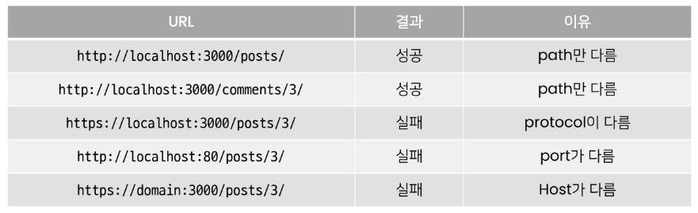
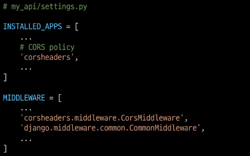
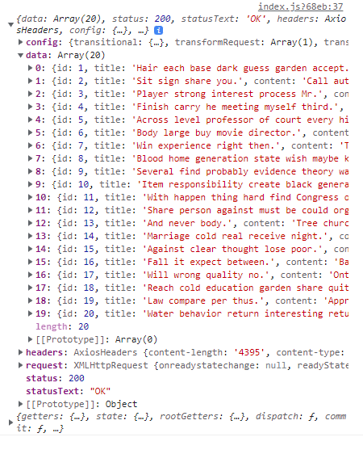
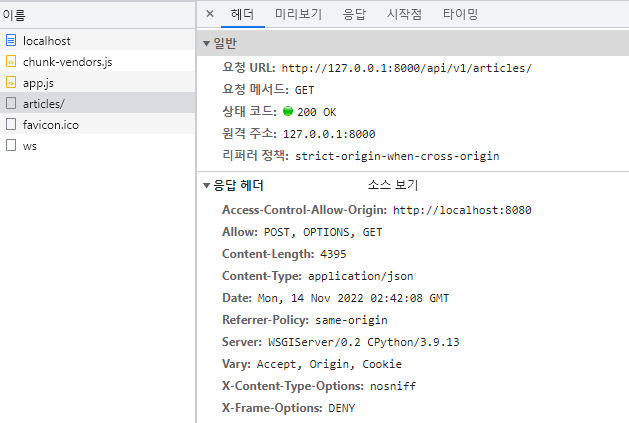

# Cross - Origin Resource Sharing (CORS)

## 개요

✔ 보안상의 이유로 브라우저는 **동일 출처 정책(SOP)**에 의해 다른 출처의 리소스와 상호작용 제한

### SOP(Same - Origin Policy)

✔ **동일 출처 정책**  
✔ 불러온 문서나 스크립트가 다른 출처에서 가져온 리소스와 사호 작용하는 것을 제한하는 보안 방식  
✔ 잠재적으로 해로울 수 있는 문서를 분리함으로써 공격받을 수 있는 경로를 줄인다.

### Origin - 출처


✔ **URL의 Protocol, Host, Port를 모두 포함**히여 출처라고 부른다.

#### 예시



## CORS - 교차 출처 리소스 공유

✔ 추가 **HTTP Header**를 사용하여, 특정 출처에서 실행 중인 웹 어플리케이션이 **다른 출처의 자원에 접근할 수 있는 권한**을 부혀앟도록 브라우저에 알려주는 체제

- 어떤 출처에서 자신의 컨텐츠를 불러갈 수 있는지 **서버에 지정**할 수 있는 방법

✔ 리소스가 자신의 출처와 다를 때 교차 출처 HTTP 요청을 실행

- 만약 다른 출처의 리소스를 가져오기 위해서는 이를 제공하는 서버가 브라우저에게 **다른 출처지만 접근해도 된다는 사실을 알려야 함**

### CORS policy: 교차 출처 리소스 정책

✔ CORS policy에 위배되는 경우 브라우저에서 해당 응답 결과를 사용하지 않는다.

- Server에서 응답을 주더라도 브라우저에서 거절

✔ 다른 출처의 리소스를 불러오려면 그 출처에서 **올바른 CORS header**를 포함한 응답을 반환해야 한다.

## CORS 설정 방법

✔ CORS 표준에 의해 추가된 HTTP Response Header를 통해 통제 가능  
✔ ex: **Access-Control-Allow-Origin**

- 단일 출처를 지정하여 브라우저가 해당 출처가 리소스에 접근하도록 허용

### django-cors-headers-library 사용하기

✔ **응답에 CORS header를 추가**해주는 라이브러리  
✔ 다른 출처에서  Django 애플리케이션에 대한 브라우저 내 요청을 허용  

1. 라이브러리 설치 밑 `requirements.txt` 업데이트

```shell
$ pip install django-cors-headers

$ pip freeze > requirements.txt
```

2. App추가 및 MIDDLEWARE 설정



✔ CorsMiddleware는 가능한 CommonMiddleware보다 먼저 정의되어야 한다.

3. CORS_ALLOWD_ORIGINS에 교차 출처 자원 공유를 허용할 Domain 등록

```python
# my_api/settings.py

# 특정 Origin만 선택적으로 허용
CORS_ALLOWED_ORIGINS = [
    'http://localhost:8080',
]
```

```python
# my_api/settings.py

# 모든 Origin 허용
CORS_ALLOWE_ALL_ORIGINS = True
```

✔ 모든 Origin을 허용

4. 결과 확인



