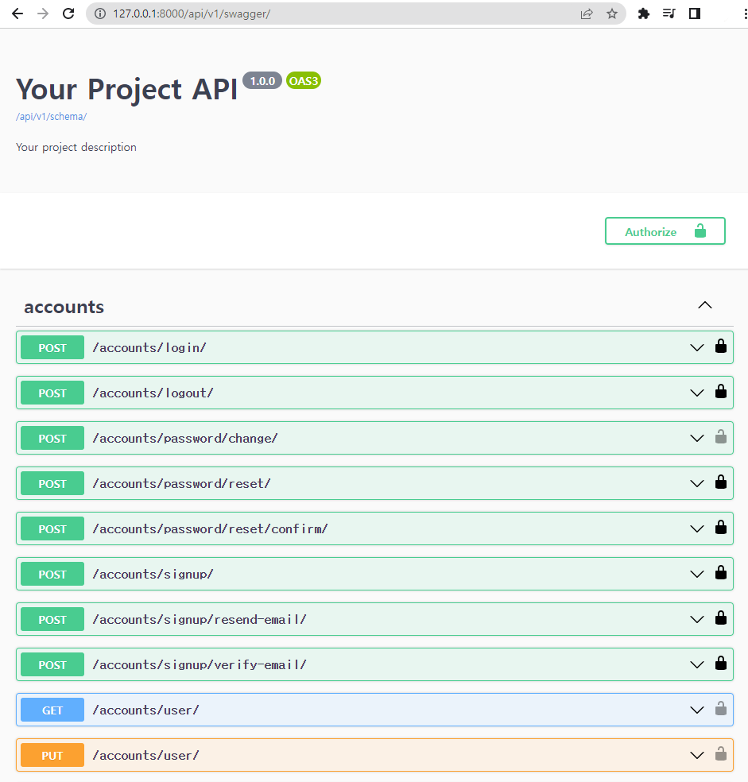

# drf-spectacular

## swagger

✔ 스웨거(swagger)는 개발자가 REST 웹 서비스를 설계, 빌드, 문서화, 소비하는 일을 도와주는 오픈 소스 소프트웨어 프레임워크  
✔ 즉, API를 설계하고 문서화 하는데 도움을 주는 라이브러리

### 다양한 DRF API
✔ 스웨거(swagger)를 생성할 수 있도록 도움을 주는 라이브러리  -> **drf-spectacular**

## drf-spectacular

✔ Open API 3.0을 지원하는 DRF API OpenAPI 생성기

1. 설치 및 등록

```shell
$ pip install drf-spectacular

$ pip freeze > requirements.txt
```

```python
# my_api/settings.py

INSTALLED_APPS = [
    'drf_spectacular'
]
```

2. 기본 설정

```python
# my_api/settings.py

REST_FRAMEWORK = {
    ...

    # spectacular Settings
    'DEFAULT_SCHEMA_CLASS': 'drf_spectacular.openapi.AutoSchema',
}

SPECTACULAR_SETTINGS = {
    'TITLE': 'Your Project API',
    'DESCRIPTION': 'Your project description',
    'VERSION': '1.0.0',
    'SERVE_INCLUDE_SCHEMA': False,
    # OTHER SETTINGS
}
```
3. URL 설정

```python
# articles/urls.py
from drf_spectacular.views import SpectacularAPIView, SpectacularSwaggerView
...


urlpatterns = [
    ...
    # 필수 작성
    path('schema/', SpectacularAPIView.as_view(), name='schema'),
    # optional UI
    path('swagger/', SpectacularSwaggerView.as_view(url_name='schema'), name='swagger-ui'),
]
```

4. 결과 확인

