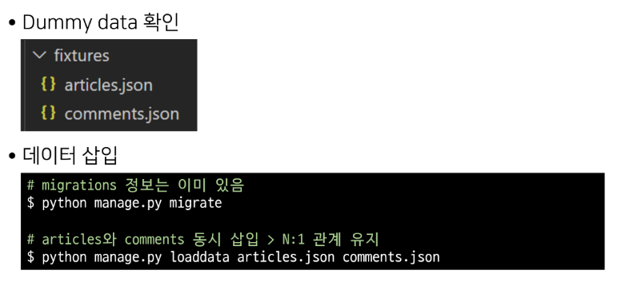
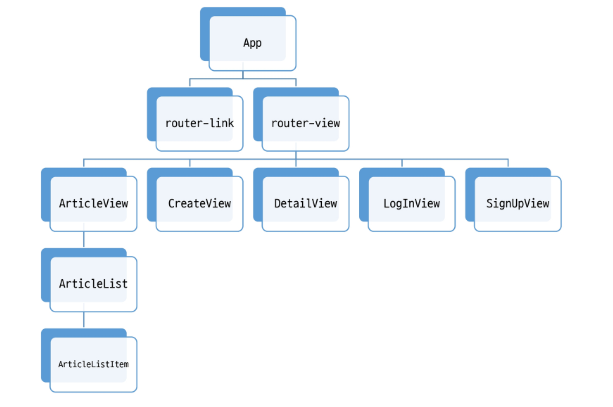
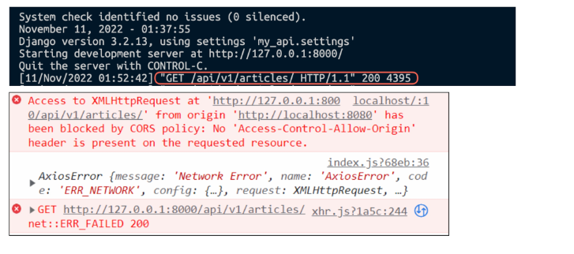

# Vue with DRF

## Server & Client

### Server

✔ 클라이언트에 정보와 서비스를 제공하는 컴퓨터 시스템  
✔ 서비스 전체를 제공 -> Django Web Service  
✔ 정보를 제공 -> Django API Service

<br>
✔ DB와 통신하며 데이터를 생성, 조회, 수정, 삭제를 담당

### Client

✔ Server가 제공하는 서비스에 적절한 요청을 통해 Server로부터 반환 받은 응답을 사용자에게 표현하는 기능을 가진 프로그램 혹은 시스템

<br>

✔ 응답받은 정보를 가공하여 화면에 표현

## DRF

### Back skeleton 코드 확인

1. Models

```python
from django.db import models
from django.conf import settings

# Create your models here.
class Article(models.Model):
    # user = models.ForeignKey(settings.AUTH_USER_MODEL, on_delete=models.CASCADE)
    title = models.CharField(max_length=100)
    content = models.TextField()
    created_at = models.DateTimeField(auto_now_add=True)
    updated_at = models.DateTimeField(auto_now=True)


class Comment(models.Model):
    article = models.ForeignKey(Article, on_delete=models.CASCADE)
    content = models.TextField()
    created_at = models.DateTimeField(auto_now_add=True)
    updated_at = models.DateTimeField(auto_now=True)


```

2. 요청 경로 확인

```python
# articles/urls.py

# from drf_spectacular.views import SpectacularAPIView, SpectacularSwaggerView
from django.urls import path
from . import views


urlpatterns = [
    path('articles/', views.article_list),
    path('articles/<int:article_pk>/', views.article_detail),
    path('comments/', views.comment_list),
    path('comments/<int:comment_pk>/', views.comment_detail),
    path('articles/<int:article_pk>/comments/', views.comment_create),
    # # 필수 작성
    # path('schema/', SpectacularAPIView.as_view(), name='schema'),
    # # optional UI
    # path('swagger/', SpectacularSwaggerView.as_view(url_name='schema'), name='swagger-ui'),
]
```

```python
# my_api/urls.py

from django.contrib import admin
from django.urls import path, include

urlpatterns = [
    path('admin/', admin.site.urls),
    path('api/v1/', include('articles.urls')),
    # path('accounts/', include('dj_rest_auth.urls')),
    # path('accounts/signup/', include('dj_rest_auth.registration.urls'))
]
```

3. 더미 데이터 삽입



## Vue

### front 컴포넌트 구조 확인



### 메인 페이지 구성

1. `views/ArticleView.vue` component 확인 및 route 등록

```javascript
// src/router/index.js

import Vue from 'vue'
import VueRouter from 'vue-router'
import ArticleView from '@/views/ArticleView'

Vue.use(VueRouter)

const routes = [
  {
    path: '/',
    name: 'ArticleView',
    component: ArticleView
  },
  ...
]
```

```vue
// src/views/ArticleView.vue

<template>
  <div>
    <h1>Article Page</h1>
    <hr />
  </div>
</template>

<script>
export default {
  name: "ArticleView",
  components: {},
  computed: {},
  created() {},
  methods: {},
};
</script>
```

2. `src/App.vue` router-link 등록

```html
// src/App.vue

<nav>
  <router-link :to="{ name: 'ArticleView' }">Articles</router-link>
</nav>
```

3. `components/ArticleList.vue` 확인

```vue
// components/ArticleList.vue

<template>
  <div class="article-list">
    <h3>Article List</h3>
  </div>
</template>

<script>

export default {
  name: 'ArticleList',
  components: {
  },
  computed: {
  }
}
</script>

<style>
.article-list {
  text-align: start;
}
</style>
```

4. ArticleList 하위 컴포넌트 등록

```vue
// views/ArticleView.vue

<template>
  <div>
    <h1>Article Page</h1>
    <hr>
    <ArticleList/>
  </div>
</template>

<script>
import ArticleList from '@/components/ArticleList'


export default {
  name: 'ArticleView',
  components: {
    ArticleList
  },
  computed:{
  },
  created() {
  },
  methods: {
  }
}
</script>
```

5. `components/ArticleListItem.vue` 확인

```vue
// compoents/ArticleListItem.vue

<template>
  <div>
    <h5>PK</h5>
    <p>제목</p>
    <hr>
  </div>
</template>

<script>
export default {
  name: 'ArticleListItem',
}
</script>
```

6. ArticleListItem 하위 컴포넌트 등록

```vue
// components/ArticleList.vue

<template>
  <div class="article-list">
    <h3>Article List</h3>
    <ArticleListItem/>
  </div>
</template>

<script>
import ArticleListItem from '@/components/ArticleListItem'

export default {
  name: 'ArticleList',
  components: {
    ArticleListItem
  },
  computed: {
  }
}
</script>
```

7. `store/index.js` state에 article 배열 정의

```javascript
// store/index.js


export default new Vuex.Store({
  state: {
    articles: [
      {
        id: 1,
        title: '제목',
        content: '내용'
      },
      {
        id: 2,
        title: '제목2',
        content: '내용2'
      },
    ],
  },
})
```

8. state에서 articles 데이터 가져와서 pass props

```vue
// components/ArticleList.vue

<template>
  <div class="article-list">
    <h3>Article List</h3>
    <ArticleListItem
      v-for="article in articles"
      :key="article.id"
      :article='article'
    />
  </div>
</template>

<script>
import ArticleListItem from '@/components/ArticleListItem'

export default {
  name: 'ArticleList',
  components: {
    ArticleListItem
  },
  computed: {
    articles() {
      return this.$store.state.articles
    }
  }
}
</script>
```

9. 내려 받은 prop 데이터로 화면 구성

```vue
// compoents/ArticleListItem.vue

<template>
  <div>
    <h5>{{ article.id }}</h5>
    <p>{{ article.title }}</p>
    <hr>
  </div>
</template>

<script>
export default {
  name: 'ArticleListItem',
  props: {
    article: Object
  }
}
</script>
```

## Vue with DRF

### AJAX 요청 준비

1. axios 설정

```shell
$ npm install axios
```

```javascript
// store/index.js

import axios from 'axios'

const API_URL = 'http://127.0.0.1:8000'
```

✔ 요청 보낼 API server 도메인 변수에 담기

2. `getArticles` 메서드 정의

```javascript
// store/index.js

export default new Vuex.Store({
  ...
  actions: {
    getArticles(context) {
      axios({
        method: 'get',
        url: `${API_URL}/api/v1/articles/`
      })
        .then((res) => {
          console.log(res, context)
        })
        .catch((err) => {
          console.log(err)
        })
    }
  },
})
```

3. view에서 `getArticles` actions 호출

```vue
// vies/ArticleView.vue

<script>
import ArticleList from '@/components/ArticleList'


export default {
  name: 'ArticleView',
  components: {
    ArticleList
  },
  computed:{
  },
  created() {
    this.getArticles()
  },
  methods: {
    getArticles() {
      this.$store.dispatch('getArticles')
    }
  }
}
</script>
```
✔ 인스턴스가 생성된 직후 요청을 보내기 위해 created() hook 사용  

### 요청 결과 확인



✔ server에서는 200을 반환하였으나 client console에서는 Error 발생!