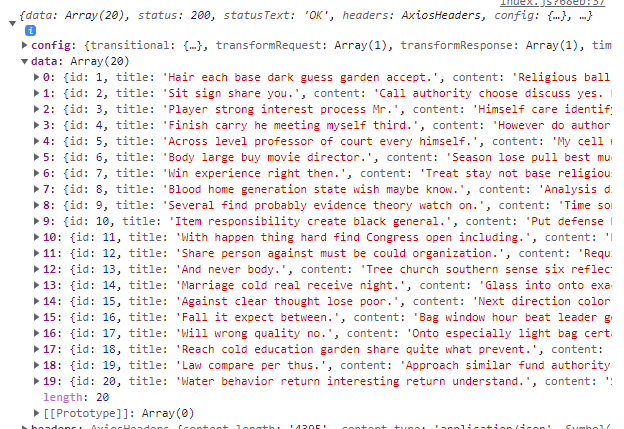
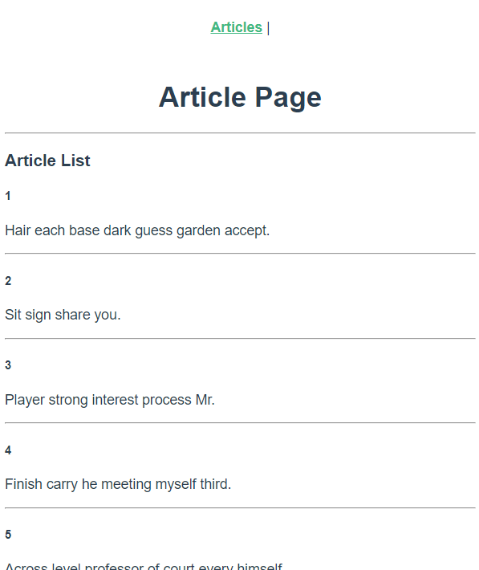
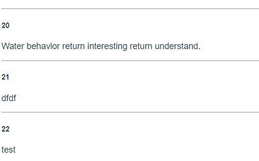
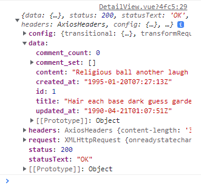
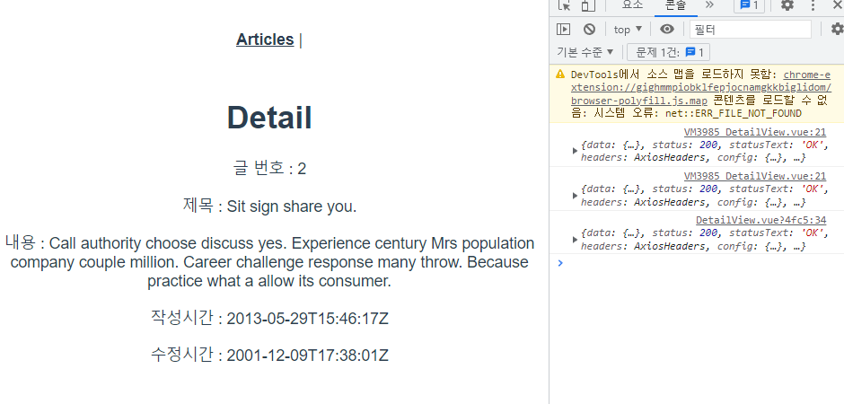

# Vue with DRF

## Article Read

1. 응답 받은 데이터 구조 확인



✔ dataArray에 각 게시글 객체  
✔ 각 게시글 객체는 id, title, content로 구성

2. store/index.js 수정

```javascript
// store/index.js

export default new Vuex.Store({
  state: {
    articles: [],
  },
  getters: {
  },
  mutations: {
    GET_ARTICLES(state, articles) {
      state.articles=articles
    }
  },
  actions: {
    getArticles(context) {
      axios({
        method: 'get',
        url: `${API_URL}/api/v1/articles/`
      })
        .then((res) => {
          // console.log(res, context)
          context.commit('GET_ARTICLES', res.data)
        })
        .catch((err) => {
          console.log(err)
        })
    }
})
```

3. 결과 확인



## Article Create

1. `views/CreateView.vue` 코드 확인

```vue
// views/CreateView.vue

<template>
  <div>
    <h1>게시글 작성</h1>
    <form @submit.prevent='createArticle'>
      <label for="title">제목 : </label>
      <input type="text" id="title" v-model.trim="title"><br>
      <label for="content">내용 : </label>
      <textarea id="content" cols="30" rows="10" v-model="content"></textarea><br>
      <input type="submit" id="submit">
    </form>
  </div>
</template>
```

✔ `v-model.trim`을 활용해 사용자 입력에서 데이터 공백 제거  
✔ `.prevent`활용해 form의 기본 이벤트 동작 막기

2. `views/CreateView.vue` 코드 확인

```vue
<script>
export default {
  name: 'CreateView',
  data() {
    },
  methods: {
    createArticle() {
      const title = this.title
      const content = this.content
      if (!title) {
        alert('제목을 입력해주세요')
        return
      } else if (!content) {
        alert('내용을 입력해주세요')
        return
      }
    }
  }
}
</script>
```

✔ title, content가 비었다면 alert를 통해 경고창을 띄우고 AJAX 요청을 보내지 않도록 return 시켜 함수를 종료

3. `views/CreateView.vue` 코드 확인

```vue
// views/CreateView.vue

<script>
import axios from 'axios'

const API_URL = 'http://127.0.0.1:8000'

export default {
  name: 'CreateView',
  methods: {
    createArticle() {
      const title = this.title
      const content = this.content
      if (!title) {
        alert('제목을 입력해주세요')
        return
      } else if (!content) {
        alert('내용을 입력해주세요')
        return
      }
      axios({
        method: 'post',
        url: `${API_URL}/api/v1/articles/`,
        data: {
          title: title,
          content: content
        }
      })
        .then((res) => {
          console.log(res)
        })
        .catch((err) => {
          console.log(err)
        })
    }
  }
}
</script>
```

✔ axios를 사용해 server에 게시글 생성 요청  
✔ state를 변화 시키는 것이 아닌 DB에 게시글 생성 후 ArticleView로 이동할 것이므로 methods에서 직접 처리

4. `router/index.js`

```javascript
// router/index.js

import CreateView from '@/views/CreateView'


Vue.use(VueRouter)

const routes = [
  ...
 
  {
    path: '/create',
    name: 'CreateView',
    component: CreateView
  },
  ...
]
```

5. `views/ArticleView.vue`

```vue
<template>
  <div>
    <h1>Article Page</h1>
    <router-link :to="{ name: 'CreateView' }">[CREATE]</router-link>
    <hr>
    <ArticleList/>
  </div>
</template>
```

✔ router-link를 통해 CreateView로 이동

6. `views/CreateView.vue`

```vue
// views/CreateView.vue

<script>
import axios from 'axios'

const API_URL = 'http://127.0.0.1:8000'

export default {
  name: 'CreateView',
  methods: {
    createArticle() {
      const title = this.title
      const content = this.content
      if (!title) {
        alert('제목을 입력해주세요')
        return
      } else if (!content) {
        alert('내용을 입력해주세요')
        return
      }
      axios({
        method: 'post',
        url: `${API_URL}/api/v1/articles/`,
        data: {
          title: title,
          content: content
        }
      })
        .then(() => {
          this.$router.push({name: 'ArticleView'})
        })
        .catch((err) => {
          console.log(err)
        })
    }
  }
}
</script>
```

✔ 게시글 생성 완료 후 ArticleView로 이동  
✔ 응답 확인을 위해 정의한 인자 `res`제거  

7. 결과 확인



✔ `ArticleView`가 create될 때마다 server에 게시글 전체 데이터를 요청하기 때문에 router만 이동해도 보인다.  


### [참고] 지금 요청 방식이 과연 효율적인가?
✔ 전체 게시글 정보를 요쳥해야 새로 생성된 게시글을 확인할 수 있다.  
✔ vuex state를 통해 전체 게시글 정보를 관리하도록 구성한다면...?  
✔ 나 이외 유저들이 새롭게 생성한 게시글은 언제 불러와야 하는가...?  

## Article Detail

1. `views/DetailView.vue`

```vue

<template>
  <div>
    <h1>Detail</h1>
    <!-- <p>글 번호 : {{ article?.id }}</p>
    <p>제목 : {{ article?.title }}</p>
    <p>내용 : {{ article?.content }}</p>
    <p>작성시간 : {{ article?.created_at }}</p>
    <p>수정시간 : {{ article?.updated_at }}</p> -->
  </div>
</template>

<script>
export default {
  name: 'DetailView',
  data() {
  },
  created() {
  },
  methods: {
  }
}
</script>
```

✔ 게시글 상세 정보를 표현할 컴포넌트  
✔ AJAX 요청으로 응답 받아올 article의 상세 정보들을 표현  

2. `router/index.js` 등록

```javascript
// router/index.js

..
import DetailView from '@/views/DetailView'
...

Vue.use(VueRouter)

const routes = [
  ...
  {
    path: '/:id',
    name: 'DetailView',
    component: DetailView,
  },
]
```

✔ id를 동적인자로 받아 특정 게시글에 대한 요청  

3. `components/ArticleListItem.vue`

```vue
// compoents/ArticleListItem.vue

<template>
  <div>
    <h5>{{ article.id }}</h5>
    <p>{{ article.title }}</p>
    <router-link
      :to="{
        name: 'DetailView',
        params: { id: article.id }
      }"
    >
      [DETAIL]
    </router-link>
    <hr>
  </div>
</template>

<script>
export default {
  name: 'ArticleListItem',
  props: {
    article: Object
  }
}
</script>
```

✔ router-link를 통해 특정 게시글의 id값을 동적 인자로 전달  
✔ 게시글 상세 정보를 server에 요청

4. `views/DetailView.vue`

```vue
// views/DetailView.vue

<script>
import axios from 'axios'

const API_URL = 'http://127.0.0.1:8000'

export default {
  name: 'DetailView',
  created() {
    this.getArticleDetail()
  },
  methods: {
    getArticleDetail() {
      axios({
        method: 'get',
        url: `${API_URL}/api/v1/articles/${this.$route.params.id}/`
      })
        .then((res) => {
          console.log(res)
        })
        .catch((err) => {
          console.log(err)
        })
    }
  }
}
</script>
```

✔ `this.$route.params`를 활용해 컴포넌트가 create될 때 넘겨받은 id로 상세 정보 AJAX 요청  

5. 요청 결과 확인



6. `views/DetailView.vue` 수정

```vue
// views/DetailView.vue

<template>
  <div>
    <h1>Detail</h1>
    <p>글 번호 : {{ article?.id }}</p>
    <p>제목 : {{ article?.title }}</p>
    <p>내용 : {{ article?.content }}</p>
    <p>작성시간 : {{ article?.created_at }}</p>
    <p>수정시간 : {{ article?.updated_at }}</p>
  </div>
</template>

<script>
import axios from 'axios'

const API_URL = 'http://127.0.0.1:8000'

export default {
  name: 'DetailView',
  data() {
    return {
      article:null
    }
  },
  created() {
    this.getArticleDetail()
  },
  methods: {
    getArticleDetail() {
      axios({
        method: 'get',
        url: `${API_URL}/api/v1/articles/${this.$route.params.id}/`
      })
        .then((res) => {
          this.article=res.data
        })
        .catch((err) => {
          console.log(err)
        })
    }
  }
}
</script>
```

✔ 응답 받은 정보를 data에 저장  
✔ data에 담기까지 시간이 걸리므로 optional chaining을 활용해 데이터 표기  

7. 결과 확인



