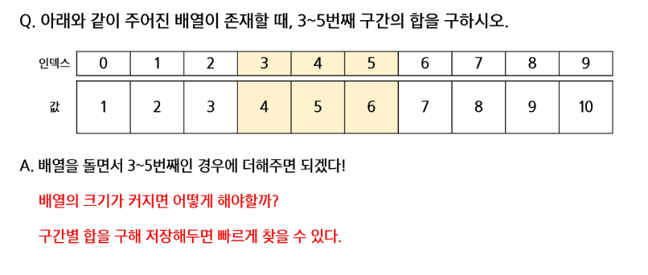
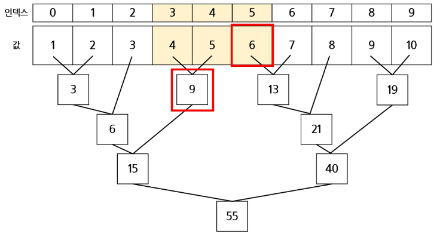
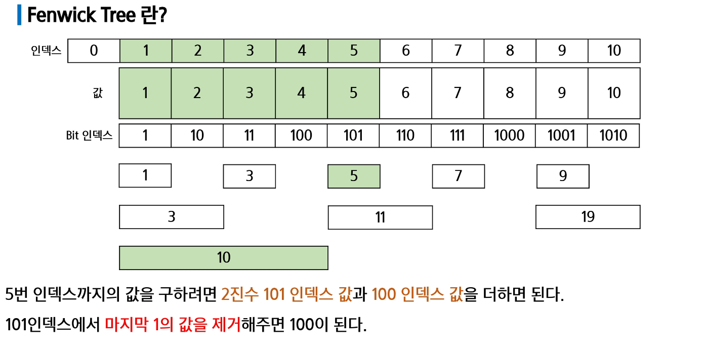
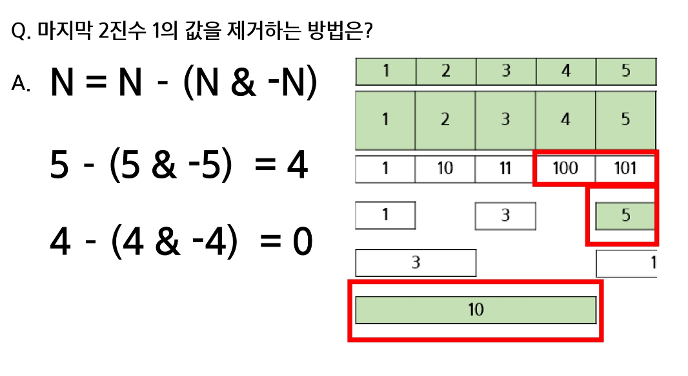

# Segment Tree

## Segment Tree란?

✔ 어떤 데이터가 존재할 때, 특정 구간의 결과값을 구하는데 사용하는 자료 구조!



✔ prefix sum? -> 유용하지만 **값의 변경**에 취약하다



✔ 따라서 segment tree는 이진 트리 구조를 가진다!  

✔ 목표로 하는 값을 최대로 커버하는 범위의 segment들을 더해서 합을 구한다

✔ **값 변경 시에 자식 노드의 값만 바꾸면 되기 때문에 logN 시간 복잡도로 대응할 수 있다!**

## 전체 코드 (재귀적으로 구현)

```python
from math import log2, ceil, gcd


class SegmentTree:
    def __init__(self, input_list, calculation_method='sum'):
        self.level = 0
        self.length = 0
        self.input_list = input_list
        self.input_list_length = len(self.input_list)
        self.input_start_index = 0
        self.tree_index = 1
        self.input_end_index = self.input_list_length - 1
        self.calculation_method = calculation_method
        self.result_list = []

    def method(self, left_result, right_result):
        if self.calculation_method == 'sum':
            return left_result + right_result
        elif self.calculation_method == 'max':
            return max(left_result, right_result)
        elif self.calculation_method == 'gcd':
            return gcd(left_result, right_result)

    def update_process(self, input_start_index, input_end_index, tree_index, update_index, update_value):
        # 구간에 영향을 미치지 않는 경우.
        if update_index < input_start_index or update_index > input_end_index:
            return self.result_list[tree_index]

        # 업데이트하고자하는 위치에 도달한 경우.
        if input_start_index == input_end_index:
            self.result_list[tree_index] = update_value
            return self.result_list[tree_index]

        input_mid_index = (input_start_index + input_end_index) // 2

        left_result = self.update_process(input_start_index, input_mid_index, tree_index * 2, update_index, update_value)

        right_result = self.update_process(input_mid_index + 1, input_end_index, tree_index * 2 + 1, update_index, update_value)

        self.result_list[tree_index] = self.method(left_result, right_result)

        return self.result_list[tree_index]

    def update(self, update_index, update_value):
        self.tree_index = 1
        self.input_list[update_index] = update_value

        self.update_process(self.input_start_index, self.input_end_index, self.tree_index, update_index, update_value)

    def get_range_process(self, input_start_index, input_end_index, tree_index, range_start_index, range_end_index):
        if input_end_index < range_start_index or input_start_index > range_end_index:
            return 0

        if input_start_index >= range_start_index and input_end_index <= range_end_index:
            return self.result_list[tree_index]

        input_mid_index = (input_start_index + input_end_index) // 2

        left_result = self.get_range_process(input_start_index, input_mid_index, tree_index * 2, range_start_index, range_end_index)

        right_result = self.get_range_process(input_mid_index + 1, input_end_index, tree_index * 2 + 1, range_start_index, range_end_index)

        return self.method(left_result, right_result)

    def get_range(self, range_start_index, range_end_index):
        self.tree_index = 1
        return self.get_range_process(self.input_start_index, self.input_end_index, self.tree_index, range_start_index, range_end_index)

    def process(self, input_start_index, input_end_index, tree_index):
        if input_start_index == input_end_index:
            self.result_list[tree_index] = self.input_list[input_start_index]
            return self.result_list[tree_index]

        input_mid_index = (input_start_index + input_end_index) // 2

        left_result = self.process(input_start_index, input_mid_index, tree_index * 2)

        right_result = self.process(input_mid_index + 1, input_end_index, tree_index * 2 + 1)

        self.result_list[tree_index] = self.method(left_result, right_result)

        return self.result_list[tree_index]

    def make(self):
        self.level = ceil(log2(self.input_list_length)) + 1
        self.length = pow(2, self.level)
        self.result_list = [0] * self.length
        self.process(0, self.input_list_length-1, 1)


def main():
    #number_list = [1, 2, 3, 4, 5, 6, 7, 8, 9, 10]
    number_list = [1, 2, 5, 5, 5, 5, 5, 5, 9, 10]

    segment_tree_sum = SegmentTree(number_list, 'sum')
    segment_tree_sum.make()
    print(segment_tree_sum.result_list)
    print(segment_tree_sum.get_range(3, 5))
    segment_tree_sum.update(4, 7)
    print(segment_tree_sum.result_list)
    print(segment_tree_sum.get_range(3, 5))

    segment_tree_max = SegmentTree(number_list, 'max')
    segment_tree_max.make()
    print(segment_tree_max.result_list)
    print(segment_tree_max.get_range(3, 5))
    segment_tree_max.update(4, 7)
    print(segment_tree_max.result_list)
    print(segment_tree_max.get_range(3, 5))

    segment_tree_gcd = SegmentTree(number_list, 'gcd')
    segment_tree_gcd.make()
    print(segment_tree_gcd.result_list)
    print(segment_tree_gcd.get_range(3, 5))
    segment_tree_gcd.update(4, 7)
    print(segment_tree_gcd.result_list)
    print(segment_tree_gcd.get_range(3, 5))


if __name__ == '__main__':
    main()

```

### 트리 만들기

```python
def process(self, input_start_index, input_end_index, tree_index):

    # 1. 리프노드라면 tree_index에 현재 값을 채우고 해당 값을 반환(가지고 올라옴) 
    if input_start_index == input_end_index:
        self.result_list[tree_index] = self.input_list[input_start_index]
        return self.result_list[tree_index]

    # 2. 다음 좌/우 구분하기 위해 중간값 찾기
    input_mid_index = (input_start_index + input_end_index) // 2

    # 3. 왼쪽값과 오른쪽값 가져오기  
    left_result = self.process(input_start_index, input_mid_index, tree_index * 2)

    right_result = self.process(input_mid_index + 1, input_end_index, tree_index * 2 + 1)

    # 4. 두 갑의 연산결과를 현 위치에 저장하고 해당값을 반환
    self.result_list[tree_index] = self.method(left_result, right_result)
    return self.result_list[tree_index]
```

✔ 재귀적으로 내려가서 리프노드에서부터 트리를 채우면서 올라온다! 

### 쿼리

```python
    def get_range_process(self, input_start_index, input_end_index, tree_index, range_start_index, range_end_index):

        # 범위를 완전하게 벗어난 위치(구간)은 무효
        if input_end_index < range_start_index or input_start_index > range_end_index:
            return 0 

        # 구간에 완전히 들어가는 경우(리프이거나 아닐 수도 있다.) 
        # 더이상 재귀적으로 내려가지 않고 바로 값을 반환다.
        if input_start_index >= range_start_index and input_end_index <= range_end_index:
            return self.result_list[tree_index]

        # 구간에 일부만 걸친 경우 좌/우로 재귀적으로 계속 내려간다.
        input_mid_index = (input_start_index + input_end_index) // 2

        left_result = self.get_range_process(input_start_index, input_mid_index, tree_index * 2, range_start_index, range_end_index)

        right_result = self.get_range_process(input_mid_index + 1, input_end_index, tree_index * 2 + 1, range_start_index, range_end_index)

        return self.method(left_result, right_result)
```

✔ 함수 호출 형태는 process(처음에 트리를 채우는 과정)과 동일하다!  

✔ 내가 구하고자 하는 범위(range_start_index, range_end_index)는 변하지 않는다.  
✔ 재귀 호출을 타고 내려가면서 구하고자 하는 범위에 완전히 들어가는 구간의 값을 찾아서 반환한다.

### update

```python
    def update_process(self, input_start_index, input_end_index, tree_index, update_index, update_value):
        # 구간에 영향을 미치지 않는 경우.
        # 값을 그대로 반환한다.
        if update_index < input_start_index or update_index > input_end_index:
            return self.result_list[tree_index]

        # 업데이트하고자하는 위치에 도달한 경우.
        # 값을 바꾼다.
        if input_start_index == input_end_index:
            self.result_list[tree_index] = update_value
            return self.result_list[tree_index]

        input_mid_index = (input_start_index + input_end_index) // 2

        left_result = self.update_process(input_start_index, input_mid_index, tree_index * 2, update_index, update_value)

        right_result = self.update_process(input_mid_index + 1, input_end_index, tree_index * 2 + 1, update_index, update_value)

        self.result_list[tree_index] = self.method(left_result, right_result)

        return self.result_list[tree_index]

    def update(self, update_index, update_value):
        self.tree_index = 1
        self.input_list[update_index] = update_value

        self.update_process(self.input_start_index, self.input_end_index, self.tree_index, update_index, update_value)

```

✔ 업데이트 하는 리프노드로부터 위로 올라가면서 값을 업데이트 한다  
✔ 영향을 미치지 않는 경우는 업데이트하지 않고 값을 그대로 반환한다  

## Fenwick Tree



✔ '**구간합**'을 구하는 경우라면 모든 세그먼트가 필요한 게 아니다!  
✔ 필요한 최소의 세그먼트만 있으면 합과 차를 이용해서 모든 구간합을 구할 수 있다.



✔ 비트를 이용해 구간합을 구한다!! 

✔ 마지막 비트의 1의 자리의 위치만큼 더해준다   