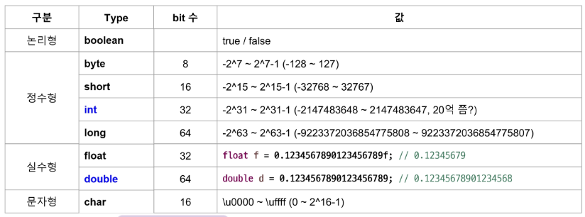
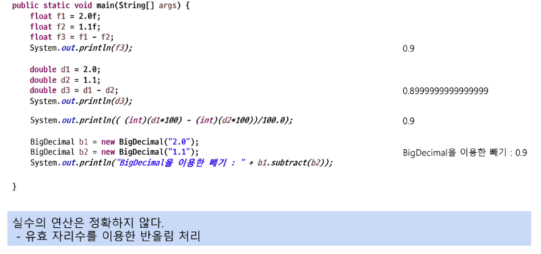
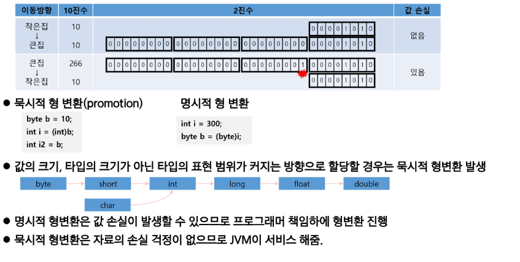
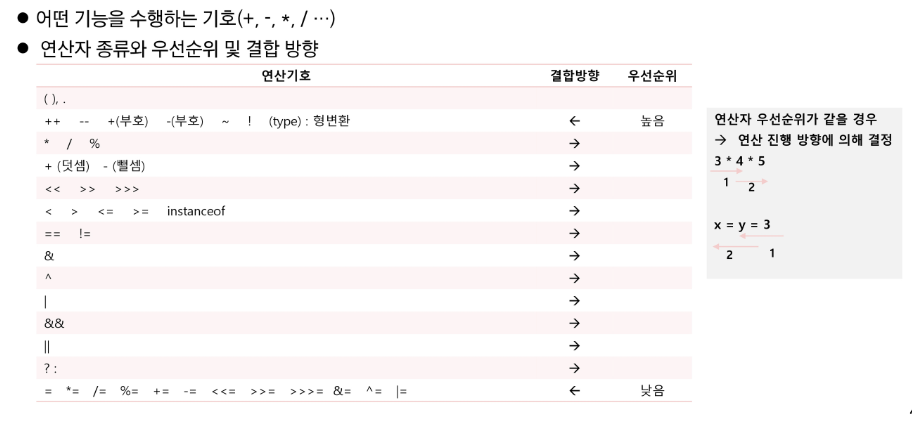

# Variable

## 기본형(primitive)의 크기

파란색: 기본형

정수형(int)의 경우 overflow에 주의하자!

부동소수점 -> 일반적인 계산은 정수형으로 변환하여 계산하기! or 반올림 처리

## 형변환

변수의 타입을 다른 타입으로 변환하는 것
- char <-> int

primitive는 primitive끼리, reference는 reference끼리 형 변환 가능
- boolean은 호환 x
- 기본 타입과 참조형의 형 변환을 위해서 Wrapper 클래스 사용

## 기본형의 형 변환 진행

형변환은 타입의 크기를 고려!

## 연산자

산술 연산의 최소 단위는 int이다! (byte 연산 시 묵시적 형변환 발생)

